  

# 一、Spring Boot 入门

## 1、Spring Boot简介


- 简化Spring应用开发的一个框架 

- 整个Spring技术栈的一个大整合


- J2EE开发的一站式解决方案


 优点：

-  快速创建独立运行的Spring项目以及与主流框架集成


- 使用嵌入式的Servlet容器，应用无需打包成war包


- starters自动依赖与版本控制


- 大量的自动配置，简化开发，也可修改默认值


- 无需配置xml，无代码生成，开箱即用


- 准生产环境的运行时应用监控


- 与云计算的天然集成


## 2、微服务

微服务：架构风格（服务微化）

一个应用应该是一组小型服务，可以通过HTTP的方式进行互通

单体应用：ALL IN ONE

微服务：每个功能元素最终都是一个可以独立替换和升级的软件单元

## 3、环境准备

环境约束

- jdk1.8
- maven 3.x :maven3.3以上
- IDEA2017
- SpringBoot 1.5.9RELEASE

## 4、springboot 的 helloworld

####  1、创建一个maven工程

file --> New --> Project


选择Maven，选择项目jdk版本


填写GroupId、Artifactid、Version信息


填写项目名（根据前面填写的ArtifactId自动识别）、项目路径


#### 2、导入Spring Boot的相关依赖

```xml
<?xml version="1.0" encoding="UTF-8"?>
<project xmlns="http://maven.apache.org/POM/4.0.0"
         xmlns:xsi="http://www.w3.org/2001/XMLSchema-instance"
         xsi:schemaLocation="http://maven.apache.org/POM/4.0.0 http://maven.apache.org/xsd/maven-4.0.0.xsd">
    <modelVersion>4.0.0</modelVersion>

    <groupId>com.dongxiaoyong</groupId>
    <artifactId>springboot-01-helloworld</artifactId>
    <version>1.0-SNAPSHOT</version>

    <parent>
        <groupId>org.springframework.boot</groupId>
        <artifactId>spring-boot-starter-parent</artifactId>
        <version>2.0.1.RELEASE</version>
        <relativePath/> <!-- lookup parent from repository -->
    </parent>

    <properties>
        <project.build.sourceEncoding>UTF-8</project.build.sourceEncoding>
        <project.reporting.outputEncoding>UTF-8</project.reporting.outputEncoding>
        <java.version>1.8</java.version>
    </properties>

    <dependencies>
        <dependency>
            <groupId>org.springframework.boot</groupId>
            <artifactId>spring-boot-starter-web</artifactId>
        </dependency>

        <dependency>
            <groupId>org.springframework.boot</groupId>
            <artifactId>spring-boot-starter-test</artifactId>
            <scope>test</scope>
        </dependency>
    </dependencies>
</project>
```

#### 3、编写一个主程序，启动springboot应用

```java
package com.dongxiaoyong;

import org.springframework.boot.SpringApplication;
import org.springframework.boot.autoconfigure.SpringBootApplication;

/**
 * Create By dongxiaoyong on /2020/5/8
 * description: 主程序入口
 * @author dongxiaoyong
 */

/**
 * @SpringBootApplication 来标注一个主程序类，说明这是一个springboot应用
 */
@SpringBootApplication
public class HelloWorldMainApplication {

    public static void main(String[] args) {
        //spring应用启动方法
        SpringApplication.run(HelloWorldMainApplication.class, args);

    }
}

```

#### 4、编写相应的Controller和Service

```java
package com.dongxiaoyong.controller;

import org.springframework.web.bind.annotation.GetMapping;
import org.springframework.web.bind.annotation.RestController;

/**
 * Create By dongxiaoyong on /2020/5/8
 * description:
 * @author dongxiaoyong
 */
@RestController
public class HelloController {

    /**
     * say hello
     * @Author :dongxiaoyong
     * @Date : 2020/5/9 15:06
     * @return: java.lang.String
    */
    @GetMapping("/hello")
    public String hello(){
        return "hello";
    }
}

```

#### 5、运行主程序测试

访问 http://127.0.0.1:8080/hello


####  6、简化部署

```xml
<build>
    <plugins>
        <!--这个插件，可以将应用打包成一个可执行的jar包-->
        <plugin>
            <groupId>org.springframework.boot</groupId>
            <artifactId>spring-boot-maven-plugin</artifactId>
        </plugin>
    </plugins>
</build>
```

pom.xml中引入了这个插件后，将项目mvn package打包后，生成的jar就可以直接用java -jar命令启动，


不引入该插件的话，直接执行会提示没有主清单属性：


 

## 5、 Hello World探究 

#### 1、pom.xml文件

1. **父项目**

   ```xml
       <parent>
           <groupId>org.springframework.boot</groupId>
           <artifactId>spring-boot-starter-parent</artifactId>
           <version>2.0.1.RELEASE</version>
           <relativePath/> <!-- lookup parent from repository -->
       </parent>
   ```

   

这个父项目**spring-boot-starter-parent**又依赖一个父项目（**spring-boot-dependencie**）

```xml
    <parent>
        <groupId>org.springframework.boot</groupId>
        <artifactId>spring-boot-dependencies</artifactId>
        <version>2.0.1.RELEASE</version>
        <relativePath>../../spring-boot-dependencies</relativePath>
    </parent>
```


**spring-boot-dependencie**项目pom.xml文件中下面有个属性properties，定义了对应的版本号 ，来管理springboot应用里面的所有依赖版本

```xml
<properties>
        <activemq.version>5.15.3</activemq.version>
        <antlr2.version>2.7.7</antlr2.version>
        <appengine-sdk.version>1.9.63</appengine-sdk.version>
        <artemis.version>2.4.0</artemis.version>
        <aspectj.version>1.8.13</aspectj.version>
        ......
    </properties>
```

Spring Boot的版本仲裁中心 ；

以后我们导入依赖默认是不需要写版本的；（没有在dependencies里面管理的依赖自然需要声明版本号）

2. **启动器**

```xml
  <dependency>
            <groupId>org.springframework.boot</groupId>
            <artifactId>spring-boot-starter-web</artifactId>
 </dependency>
```

**spring-boot-starter-web**:帮我们导入web模块正常运行所依赖的组件

**spring boot**将所有的功能场景都抽取出来，做成一个个的**starter**(启动器)，只需要在项目里引入这些**starter**，相关场景的所有依赖都会被导入进来，要用什么功能就导入什么场景的启动器。


#### 2、主程序入口

```java
@SpringBootApplication
public class HelloWorldMainApplication {

    public static void main(String[] args) {
        //spring应用启动方法
        SpringApplication.run(HelloWorldMainApplication.class, args);

    }
}
```

**@SpringBootApplication:** 说明这个类是SpringBoot的主配置类，SpringBoot就应该运行这个类的main方法来启动应用。

进入**@SpringBootApplication**注解类

```java

@Target(ElementType.TYPE)
@Retention(RetentionPolicy.RUNTIME)
@Documented
@Inherited
@SpringBootConfiguration
@EnableAutoConfiguration
@ComponentScan(excludeFilters = {
		@Filter(type = FilterType.CUSTOM, classes = TypeExcludeFilter.class),
		@Filter(type = FilterType.CUSTOM, classes = AutoConfigurationExcludeFilter.class) })
public @interface SpringBootApplication {

	......
}

```

1.**@SpringBootConfiguration**: springboot 的注解，标注在某个类上面，表示这是一个springboot的配置类；

```java
@Target(ElementType.TYPE)
@Retention(RetentionPolicy.RUNTIME)
@Documented
@Configuration
public @interface SpringBootConfiguration {
   ......
}

```

1.1**@Configuration**:（spring自带的注解）：配置类上来标注这个注解，配置类也是spring容器中的一个组件**@Component**

​	

```java
@Target(ElementType.TYPE)
@Retention(RetentionPolicy.RUNTIME)
@Documented
@Component
public @interface Configuration {
   .......
}
```

2.**@EnableAutoConfiguration**：开启自动配置功能；

​			以前我们需要配置的东西springboot帮我们自动配置，**@EnableAutoConfiguration**告诉springboot开启自动配置功能，这样自动配置功能才能生效；

```java
@Target(ElementType.TYPE)
@Retention(RetentionPolicy.RUNTIME)
@Documented
@Inherited
@AutoConfigurationPackage
@Import(AutoConfigurationImportSelector.class)
public @interface EnableAutoConfiguration {
    ......
}
```

**@AutoConfigurationPackage**：自动配置包

```java
@Target(ElementType.TYPE)
@Retention(RetentionPolicy.RUNTIME)
@Documented
@Inherited
@Import(AutoConfigurationPackages.Registrar.class)
public @interface AutoConfigurationPackage {

}
```

**@Import**:spring  底层注解，给spring容器中导入一个组件，导入的组件由AutoConfigurationPackages.Registrar.class

将主配置类（**@SpringBootApplication**注解标注的类）的所在包以及下面所有的子包里面的所有组件扫描到Spring容器中；

```java
@Import(EnableAutoConfigurationImportSelector.class)
```

​	给容器导入组件实现：

```java
@AutoConfigurationImportSelector.class
```

​	导入哪些组件的选择器，讲所有需要导入的组件一全类名的方式返回，这些组件就会被添加到容器中，

   会给容器中导入非常多的自动配置类（xxxAutoConfiguration）,就是给容器中导入这个场景需要的所有组件，并配置好这些组件；

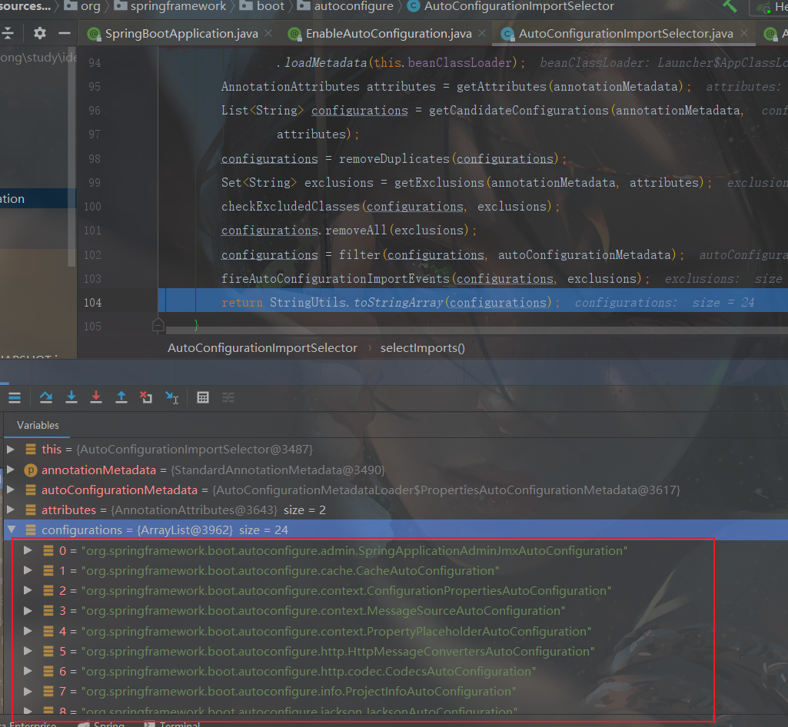

有了这些自动配置类，免去了手动编写配置注入功能组件等的工作；

```java
List<String> configurations = SpringFactoriesLoader.loadFactoryNames(EnableAutoConfiguration.class,ClassLoader);
```

**SpringBoot在启动的时候从类路径下的META-INF/spring.factories中获取EnableAutoConfiguration指定的值，将这些值作为自动配置类导入到容器中，自动配置类就生效，帮我们进行自动配置工作**

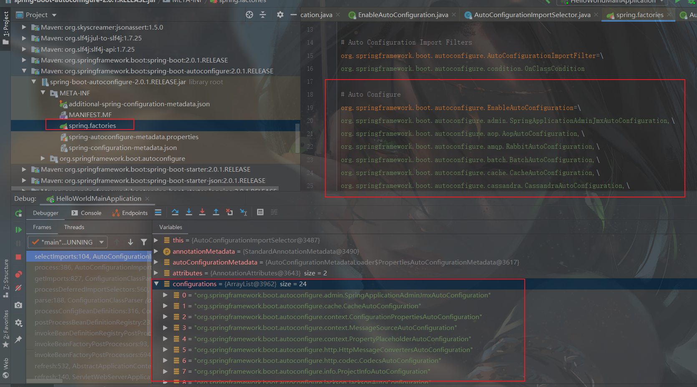

J2EE的整体整合解决方案和自动配置都在

spring-boot-autoconfigure-2.0.1.RELEASE.jar；

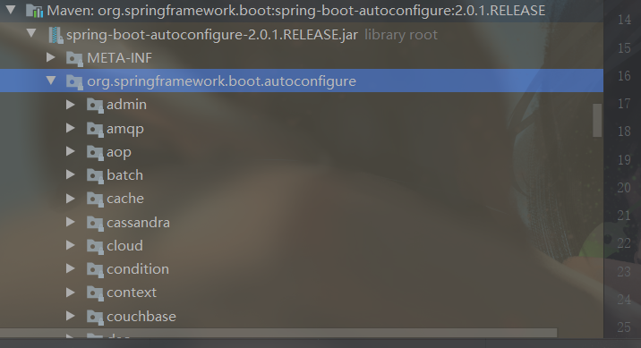

## 6、使用Spring Initializer快速创建Spring Boot项目

IDE 都支持使用Spring的项目创建向导快速创建一个Spring Boot项目

#### 二、配置文件

###### 1、配置文件

SpringBoot使用一个全局的配置文件，配置文件名是固定的；

- application.properties

- application.yml

配置文件的作用：修改Springboot自动配置的默认值，Springboot在底层都给我们自动配置好；

YAML：（YAML Ain't Markup Language）

​		YAML A Markup Language：是一个标记语言

​		YAML Ain't Markup Language：不是一个标记语言

​    以前的配置文件；大多都使用的是  **xxxx.xml**文件；

​    YAML：**以数据为中心**，比json、xml等更适合做配置文件；

###### 2、YAML语法：

以`空格`的缩进来控制层级关系；只要是左对齐的一列数据，都是同一个层级的

次等级的前面是空格，不能使用制表符(tab) 

冒号之后如果有值，那么冒号和值之间至少有一个空格，不能紧贴着

##### 字面量：普通的值（数字，字符串，布尔）

```
k: v
```

字符串默认不用加上单引号或者双引号；

`""`：双引号；不会转义字符串里面的特殊字符；特殊字符会作为本身想表示的意思

*eg：* name:   "zhangsan \n lisi"：输出；zhangsan 换行  lisi

`''`：单引号；会转义特殊字符，特殊字符最终只是一个普通的字符串数据

*eg：* name:   ‘zhangsan \n lisi’：输出；zhangsan \n  lisi

##### 对象、Map（属性和值）：

`k: v`在下一行来写对象的属性和值的关系；注意缩进

1. ```yaml
   person:
     name: 张三
     gender: 男
     age: 22
   ```

行内写法

```yaml
person: {name: 张三,gender: 男,age: 22}
```

##### 数组（List、Set）

1. ```
   fruits: 
     - 苹果
     - 桃子
     - 香蕉
   ```

行内写法

```
fruits: [苹果,桃子,香蕉]
```

###### 3、配置文件值注入

pom文件加入配置文件处理器依赖

```java
        <!--导入配置文件处理器，配置文件进行绑定就会有提示-->
        <dependency>
            <groupId>org.springframework.boot</groupId>
            <artifactId>spring-boot-configuration-processor</artifactId>
            <optional>true</optional>
        </dependency>
```

**javabean**

```java
package com.dongxiaoyong.springboot.bean;

import org.springframework.boot.context.properties.ConfigurationProperties;
import org.springframework.stereotype.Component;

import java.util.Date;
import java.util.List;
import java.util.Map;

/**
 * Create By dongxiaoyong on /2020/6/29
 * description: person
 * 将配置文件中配置的每一个值映射到这个bean中
 * 只有这个组件是容器中的组件，才能使用容器@ConfigurationProperties提供的功能
 * @author dongxiaoyong
 * @ConfigurationProperties：告诉Springboot将本类中的所有属性和配置文件中的相关配置进行绑定
 */
@Component
@ConfigurationProperties(prefix = "person", ignoreInvalidFields = true)
public class Person {
    /**
     * 姓名
     */
    private String lastName;
    /**
     * 年龄
     */
    private Integer age;
    /**
     * 是否是boss
     */
    private Boolean boss;
    /**
     * 生日
     */
    private Date birth;

    private Map<String, Object> maps;

    private List<Object> lists;
    /**
     * dog
     */
    private Dog dog;

    @Override
    public String toString() {
        return "Person{" +
                "lastName='" + lastName + '\'' +
                ", age=" + age +
                ", boss=" + boss +
                ", birth=" + birth +
                ", maps=" + maps +
                ", lists=" + lists +
                ", dog=" + dog +
                '}';
    }

    public String getLastName() {
        return lastName;
    }

    public void setLastName(String lastName) {
        this.lastName = lastName;
    }

    public Integer getAge() {
        return age;
    }

    public void setAge(Integer age) {
        this.age = age;
    }

    public Boolean getBoss() {
        return boss;
    }

    public void setBoss(Boolean boss) {
        this.boss = boss;
    }

    public Date getBirth() {
        return birth;
    }

    public void setBirth(Date birth) {
        this.birth = birth;
    }

    public Map<String, Object> getMaps() {
        return maps;
    }

    public void setMaps(Map<String, Object> maps) {
        this.maps = maps;
    }

    public List<Object> getLists() {
        return lists;
    }

    public void setLists(List<Object> lists) {
        this.lists = lists;
    }

    public Dog getDog() {
        return dog;
    }

    public void setDog(Dog dog) {
        this.dog = dog;
    }
}

```

###### 配置文件

```yaml
person:
    lastName: zhangsan
    age: 18
    boss: false
    birth: 2017/12/17
    maps: {key1: 1,key2: 2}
    lists:
      - lisi
      - zhaoliu
    dog:
      name: 小狗
      age: 2
```

###### 测试

```java
package com.dongxiaoyong.springboot;

import com.dongxiaoyong.springboot.bean.Person;
import org.junit.jupiter.api.Test;
import org.springframework.beans.factory.annotation.Autowired;
import org.springframework.boot.test.context.SpringBootTest;


@SpringBootTest
class SpringBoot02ConfigApplicationTests {
    @Autowired
    Person person;
    @Test
    void contextLoads() {
        System.out.println(person);
    }

}

```

###### 测试结果

```java
Person{lastName='zhangsan', age=18, boss=false, birth=Sun Dec 17 00:00:00 CST 2017, maps={key1=1, key2=2}, lists=[lisi, zhaoliu], dog=Dog{name='小狗', age=2}}

```


上面yaml文件对应的properties文件配置如下：

```properties
#idea，properties配置文件默认使用的是utf-8编码
#配置person
person.last-name=张三
person.age=18
person.birth=2017/12/15
person.boss=false
person.maps.key1=v1
person.maps.key2=v2
person.lists=a,b,c
person.dog.name=dog
person.dog.age=15
```

properties文件读取中文乱码问题解决：

在设置中找到`File Encodings`，将配置文件字符集改为`UTF-8`，并勾选：

-  `Transparent native-to-ascii conversion`

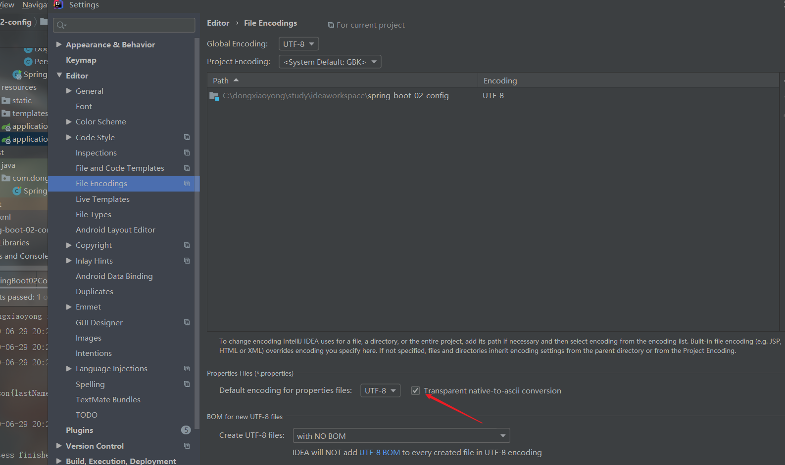

**注意：yaml和properties配置文件同时存在，properties配置文件的内容会覆盖yaml配置文件的内容**

###### 4、@Value获取值和@ConfigurationProperties获取值比较

|                                             | @ConfigurationProperties | @Value     |
| ------------------------------------------- | ------------------------ | ---------- |
| 功能                                        | 批量注入配置文件中的属性 | 一个个指定 |
| 松散绑定（松散语法）                        | 支持                     | 支持       |
| SpEL（Spring Express Language）spring表达式 | 不支持                   | 支持       |
| JSR303（数据校验）                          | 支持                     | 不支持     |
| 复杂类型封装                                | 支持                     | 不支持     |

###### 5、Profile

Profile是Spring对不同环境提供不同配置功能的支持，可以通过激活、指定参数等方式快速切换环境

###### 	1、多Profile文件	

文件名格式：application-{profile}.properties/yml，例如：

- application-dev.properties
- application-prod.properties

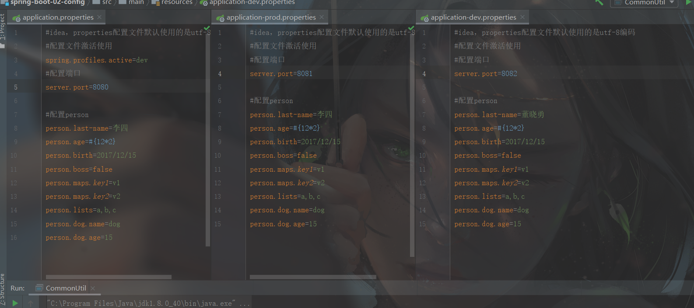

程序启动时会默认加载`application.properties`，启动的端口就是8080

可以在主配置文件中指定激活哪个配置文件

```properties
spring.profiles.active=dev
```


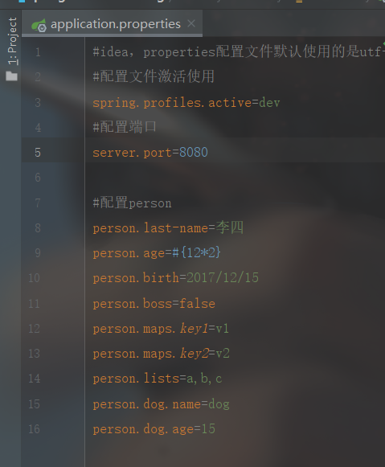

###### 2、yml支持多文档块方式

每个文档块使用 **---** 分割

```yaml
#配置文件激活使用
spring:
  profiles:
    active: dev

#配置端口
server:
  port: 8080

#配置person
person:
    lastName: 张三
    age: 18
    boss: false
    birth: 2017/12/17
    maps: {key1: 1,key2: 2}
    lists:
      - lisi
      - zhaoliu
    dog:
      name: 小狗
      age: 2

---
#测试环境配置文件
spring:
  profiles: dev

#配置端口
server:
  port: 8081
  #配置person
  person:
    lastName: 张三
    age: 18
    boss: false
    birth: 2017/12/17
    maps: {key1: 1,key2: 2}
    lists:
      - lisi
      - zhaoliu
    dog:
      name: 小狗
      age: 2
---
#生产环境配置文件
spring:
  profiles: prod
#配置端口
server:
  port: 8082
  #配置person
  person:
    lastName: 张三
    age: 18
    boss: false
    birth: 2017/12/17
    maps: {key1: 1,key2: 2}
    lists:
      - lisi
      - zhaoliu
    dog:
      name: 小狗
      age: 2
```

###### 激活指定profile的三种方式

1. 在配置文件中指定  **spring.profiles.active=dev**（如上）

2. 项目打包后在命令行启动

   ```shell
   java -jar xxx.jar --spring.profiles.active=dev；
   ```

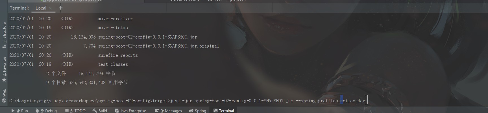

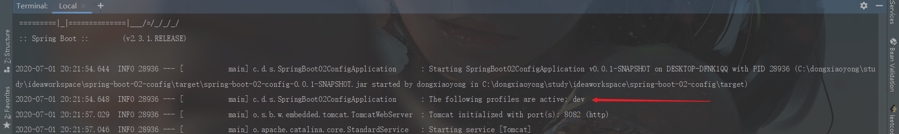

3. 虚拟机参数

```shell
-Dspring.profiles.active=prod
```

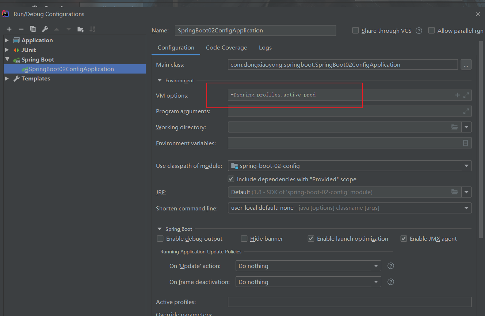

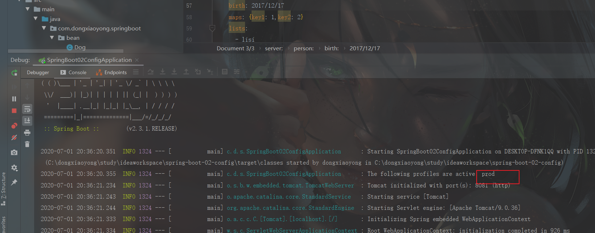

###### 6、日志使用

**默认配置**

Springboot默认帮我们设置了info级别的日志

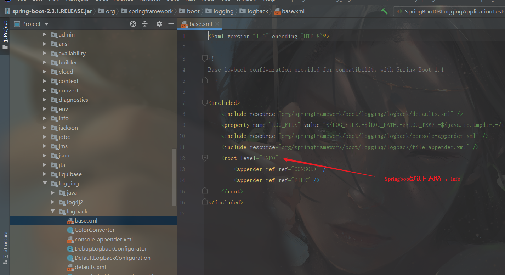

```java
package com.dongxiaoyong.springboot;

import org.junit.jupiter.api.Test;
import org.slf4j.Logger;
import org.slf4j.LoggerFactory;
import org.springframework.boot.test.context.SpringBootTest;

@SpringBootTest
class SpringBoot03LoggingApplicationTests {

    //日志记录器
    Logger logger = LoggerFactory.getLogger(getClass());
    @Test
    void contextLoads() {
        /**
         * 这是日志的级别标识，由低到高：trace < debug < info < warn < error
         *可以调整输出的日志级别，日志就只会在这个级别以及以后的高级别生效
         */
        logger.trace("这是 trace 日志。。。");
        logger.debug("这是 debug 日志。。。");
        logger.info("这是 info 日志。。。");
        logger.warn("这是 warn 日志。。。");
        logger.error("这是 error 日志。。。");
    }

}

```

**Springboot日志默认配置及格式说明**

```properties
#日志级别：trace<debug<info<warn<error，springboot默认使用的是info级别
logging.level.com.dongxiaoyong=trace

#logging.file.path 和 logging.file.name只能存在一个
#只可以指定log的路径, 不能指定log的名字, 使用缺省值spring.log
#logging.file.path=/spring/log
#可以指定路径和log文件的名字，不指定路径，则在当前项目下生成springboot.log，也可指定完整路径和文件名 C:/spring/springboot.log
logging.file.name=springboot.log

# 日志输出的格式说明：
    # %d 表示日期时间
    # %thread 表示线程名
    # %-5level 级别表示从左显示5个字符长度
    # %logger{50} 表示logger名字最长50个字符，否则按照句点分割
    # %msg 日志信息
    # %n 是换行符
#在控制台输出的日志的格式
logging.pattern.console=%d{yyyy-MM-dd hi24:mm:ss} [%thread] %-5level %logger{50} - %msg%n
#在指定文件中输入日志的格式
logging.pattern.file=%d{yyyy-MM-dd hi24:mm:ss} ==== [%thread] === %-5level === %logger{50} === %msg%n

```

| logging.file | logging.path | Example  | Description                        |
| ------------ | ------------ | -------- | ---------------------------------- |
| (none)       | (none)       |          | 只在控制台输出                     |
| 指定文件名   | (none)       | my.log   | 输出日志到my.log文件               |
| (none)       | 指定目录     | /var/log | 输出到指定目录的 spring.log 文件中 |

**自定义日志配置文件**

可以通过在类路径中放上每个日志框架自己的配置文件即可；springboot就不使用他默认配置的

各个日志框架对应的配置文件名规范如下：

| 记录系统                | 定制                                                         |
| ----------------------- | ------------------------------------------------------------ |
| Logback                 | `logback-spring.xml`, `logback-spring.groovy`, `logback.xml`, or `logback.groovy` |
| Log4j2                  | `log4j2-spring.xml` or `log4j2.xml`                          |
| JDK (Java Util Logging) | `logging.properties`                                         |

文件名采用 `logback.xml`：直接被日志框架识别

文件名采用`logback-spring.xml`:日志框架就不直接加载日志的配置项，由Springboot解析日志配置，可以使用Springboot的高级Profile功能

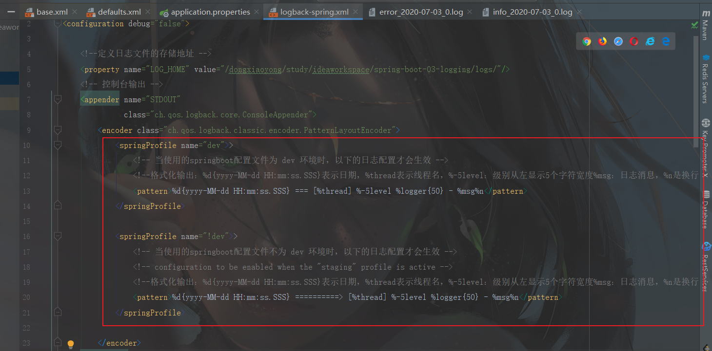

```xml
<springProfile name="dev">
				<!-- 当使用的springboot配置文件为 dev 环境时，以下的日志配置才会生效 -->
				<pattern>%d{yyyy-MM-dd HH:mm:ss.SSS} === [%thread] %-5level %logger{50} - %msg%n</pattern>
			</springProfile>

			<springProfile name="!dev">
				<!-- 当使用的springboot配置文件不为 dev 环境时，以下的日志配置才会生效 -->
				<pattern>%d{yyyy-MM-dd HH:mm:ss.SSS} ====> [%thread] %-5level %logger{50} - %msg%n</pattern>
</springProfile>
```

否则会报错：

```java
ERROR in ch.qos.logback.core.joran.spi.Interpreter@10:30 - no applicable action for [springProfile], current ElementPath  is [[configuration][appender][encoder][springProfile]]
ERROR in ch.qos.logback.core.joran.spi.Interpreter@16:31 - no applicable action for [springProfile], current ElementPath  is [[configuration][appender][encoder][springProfile]]
```

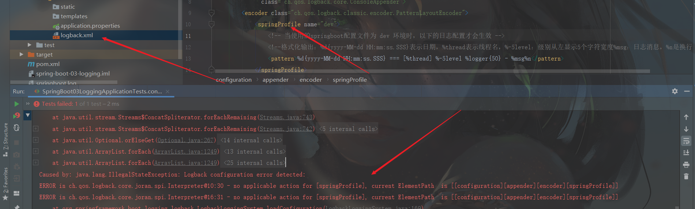

#### 三、SpringBoot Web开发

1. 创建SpringBoot应用，选中我们需要的模块
2. SpringBoot已经默认将这些场景配置好了，只需要在配置文件中指定少量配置就可以运行起来
3. 自己编写业务代码

**web自动配置规则**

1. WebMvcAutoConfiguration
2. WebMvcProperties
3. ViewResolver自动配置
4. 静态资源自动映射
5. Formatter与Converter自动配置
6. HttpMessageConverter自动配置
7. 静态首页
8. favicon
9. 错误处理

**SpringBoot对静态资源的映射规则**

`WebMvcAutoConfiguration`类的`addResourceHandlers`方法：（添加资源映射）

```java
@Override
		public void addResourceHandlers(ResourceHandlerRegistry registry) {
			if (!this.resourceProperties.isAddMappings()) {
				logger.debug("Default resource handling disabled");
				return;
			}
			Duration cachePeriod = this.resourceProperties.getCache().getPeriod();
			CacheControl cacheControl = this.resourceProperties.getCache().getCachecontrol().toHttpCacheControl();
			if (!registry.hasMappingForPattern("/webjars/**")) {
				customizeResourceHandlerRegistration(registry.addResourceHandler("/webjars/**")
						.addResourceLocations("classpath:/META-INF/resources/webjars/")
						.setCachePeriod(getSeconds(cachePeriod)).setCacheControl(cacheControl));
			}
			String staticPathPattern = this.mvcProperties.getStaticPathPattern();
			if (!registry.hasMappingForPattern(staticPathPattern)) {
				customizeResourceHandlerRegistration(registry.addResourceHandler(staticPathPattern)
						.addResourceLocations(getResourceLocations(this.resourceProperties.getStaticLocations()))
						.setCachePeriod(getSeconds(cachePeriod)).setCacheControl(cacheControl));
			}
		}
```

所有 `/webjars/**`的请求 ，都去 `classpath:/META-INF/resources/webjars/` 找资源

`webjars`：以jar包的方式引入静态资源；

[webjars官网](https://www.webjars.org/)

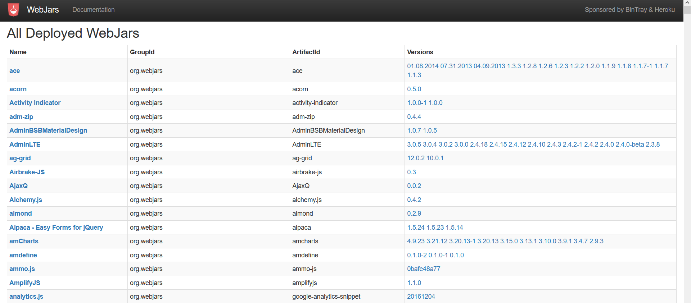

`pom.xml`文件中引入`jQuery-webjars`等依赖

```xml
<!-- 引入jQuery-webjars -->
        <dependency>
            <groupId>org.webjars</groupId>
            <artifactId>jquery</artifactId>
            <version>3.3.1</version>
        </dependency>
```


映射规则和springboot中`WebMvcAutoConfiguration`类的`addResourceHandlers`方法中规定的资源映射规则一致

所有 `/webjars/**`的请求都去`classpath:/META-INF/resources/webjars/` 找资源

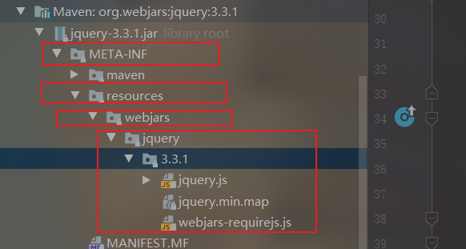

http://localhost:8080/webjars/jquery/3.3.1/jquery.js 就可以访问到引入的静态资源文件

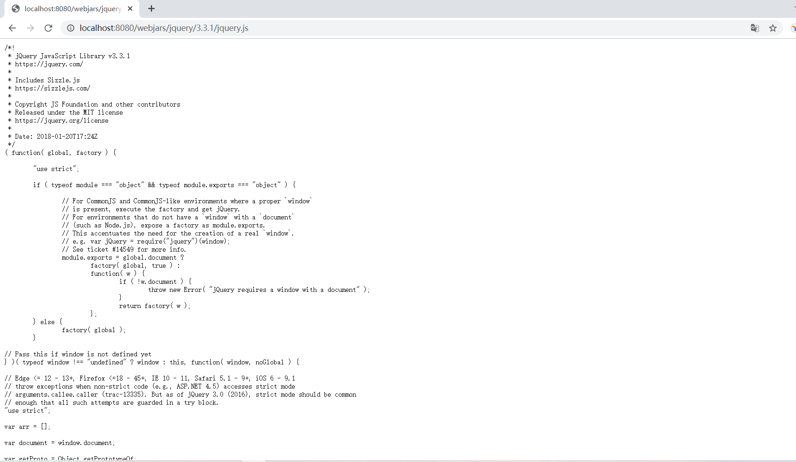

**非webjars，自己的静态资源怎么访问**

**资源配置类：**

```java
@ConfigurationProperties(    //说明可以在配置文件中配置相关参数
    prefix = "spring.resources",
    ignoreUnknownFields = false
)
public class ResourceProperties {
    private static final String[] CLASSPATH_RESOURCE_LOCATIONS = new String[]{"classpath:/META-INF/resources/", "classpath:/resources/", "classpath:/static/", "classpath:/public/"};
    private String[] staticLocations;
    private boolean addMappings;
    private final ResourceProperties.Chain chain;
    private final ResourceProperties.Cache cache;

    public ResourceProperties() {
        this.staticLocations = CLASSPATH_RESOURCE_LOCATIONS;
        this.addMappings = true;
        this.chain = new ResourceProperties.Chain();
        this.cache = new ResourceProperties.Cache();
    }
```

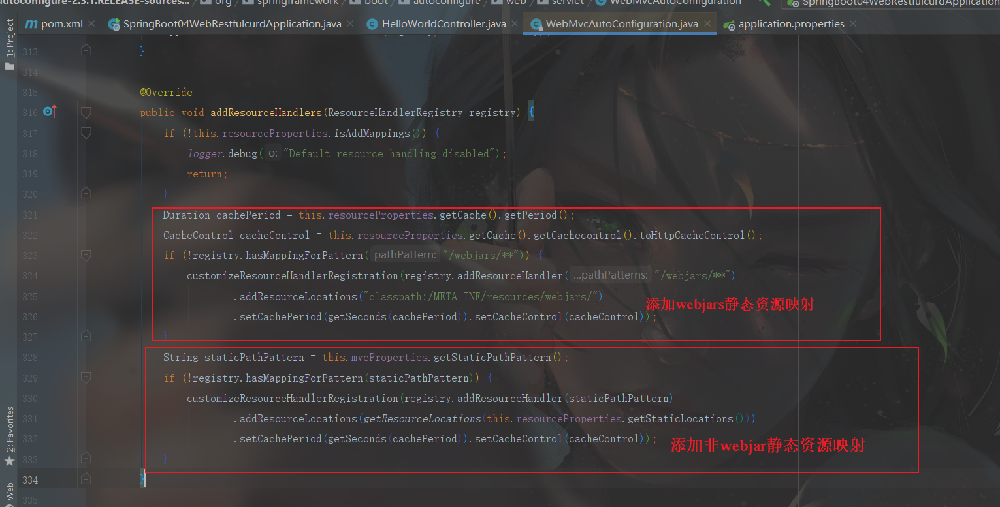

上图中添加的映射访问路径`staticPathPattern`值是`/**`，对应的资源文件夹就是上面配置类`ResourceProperties`中的`CLASSPATH_RESOURCE_LOCATIONS`数组中的文件夹：

| 数组中的值                     | 在项目中的位置                         |
| ------------------------------ | -------------------------------------- |
| classpath:/META-INF/resources/ | src/main/resources/META-INF/resources/ |
| classpath:/resources/          | src/main/resources/resources/          |
| classpath:/static/             | src/main/resources/static/             |
| classpath:/public/             | src/main/resources/public/             |
| /**                            | 当前项目的根路径                       |

http://localhost:8080/asserts/js/Chart.min.js    --->    去以上静态资源文件夹里面找`asserts`文件夹里面的`js`文件夹里面的`Chart.min.js`文件 

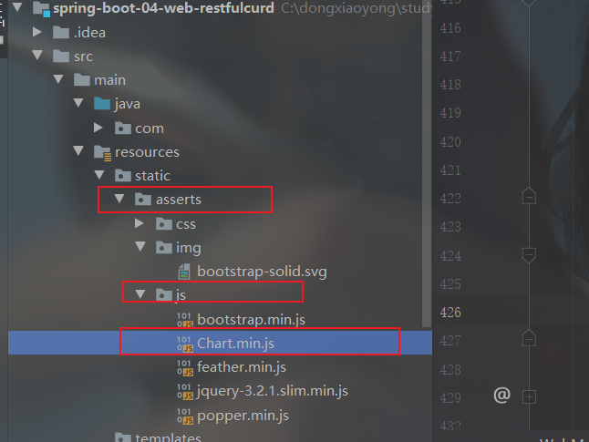

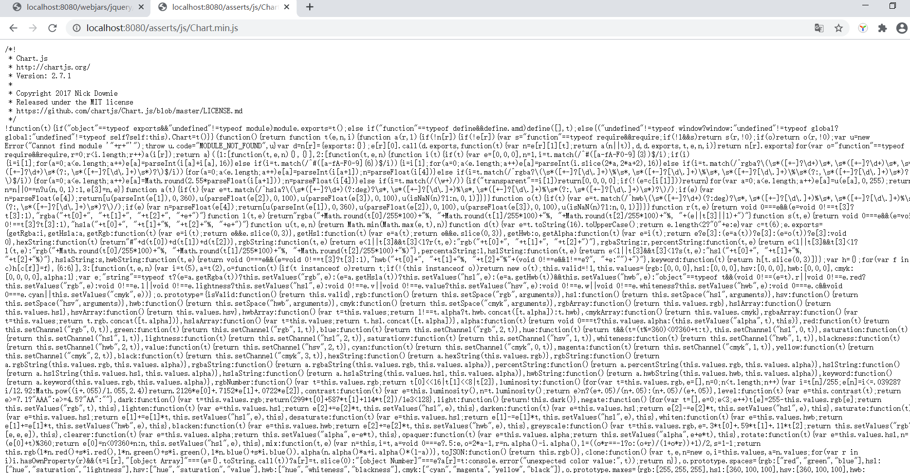

**欢迎页映射**


`location`就是静态资源路径，所以欢迎页的页面就是上面静态资源下的`index.html`，被`/**`映射，因此直接访问项目就是访问欢迎页

**网站图标映射（favicon.ico）**

所有的 favicon.ico  都是在静态资源文件下找；