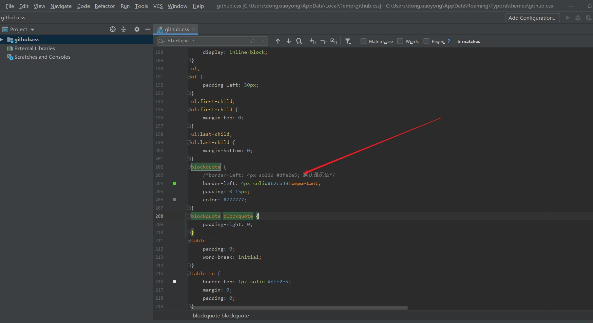

# Markdown 学习

## 一、标题

### 三级标题

#### 四级标题

## 二、字体

Helllo,World!

**Helllo,World!**    加粗：左右两个*号

*Helllo,World!*       斜体：左右一个*号

***Helllo,World!***     加粗斜体：左右三个*号

~~Helllo,World!~~      删除线：左右两个~线

<u>Hello,World!</u>       下划线：以<u></u>标签包含即可

==Hello,World!==        高亮：左右两个=号

## 三、引用

> 这就是个引用示例啊，以> 开头即可

这里的绿色是改了默认的样式，默认是灰色



## 四、分割线

以三个减号-或者星号*来实现分割线效果

三个减号：

---

三个星号：

***

## 五、图片


格式：````

## 六、超链接

格式：``[链接名称](链接地址)``

[点击跳转百度](http://www.baidu.com)

## 七、列表

有序列表: 

格式： 

1. A

2. B

3. C

   

- A  `Consistency`(强一致性)
- B  `Availabity`(可用性)
- C   `Partition tolerance`(分区容错性)

## 八、表格

格式：

```
名字|性别|生日

--|--|--|

张三|男|1997.1.1
```


名字|性别|生日
--|--|--|
张三|男|1997.1.1

## 九、代码

```java
public class Test{
    
}
```

