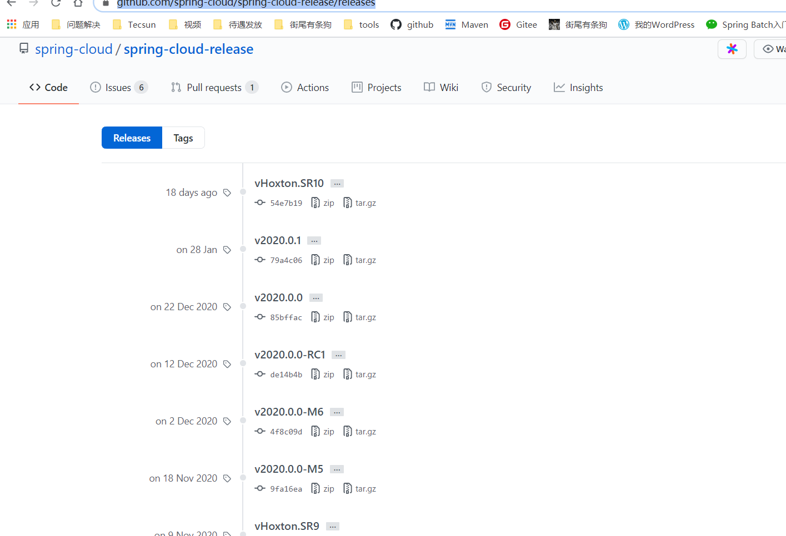

### SpringCloud与Docket微服务架构实战

#### 1.1单体应用

一个归档包（如war包）包含了所有功能的应用程序，通常成为单体应用。

##### 1.1.1优点：

- 比较容易部署、测试

##### 1.1.2弊端：

1. 复杂性高

2. 技术债务

3. 部署频率低

4. 可靠性差

5. 扩展能力受限

6. 阻碍技术创新

#### 1.2微服务

微服务机构风格是一种将单一应用程序开发为一组小型服务的方法，每个服务运行在自己的进程中，服务间通信采用轻量级通信机制(通常使用HTTP资源API)。

##### 1.2.1具体特性：

1. 每个微服务可独立运行在自己的进程里
2. 一系列独立运行的微服务共同构建器整个系统
3. 每个服务为独立的业务开发，一个微服务只关注某个特定的功能，例如订单管理、用户管理等
4. 微服务之间通过一些轻量级的通信机制进行通信，例如通过RESTful API进行调用
5. 可以使用不同的语言和数据存储技术
6. 全自动的部署机制

##### 1.2.2优点：

1. 易于开发和维护
2. 单个微服务启动较快：单个微服务代码量较少，所以启动相对来说会比较快
3. 局部修改容易部署
4. 技术栈不受限
5. 按需伸缩

##### 1.2.3缺点：

1. 运维要求高
2. 分布式固有的复杂性
3. 接口调整成本高：微服务之间通过接口进行通信，如果修改某一个微服务的API，可能所有使用了该接口的微服务都需要做调整
4. 重复劳动：很多服务可能都会使用到相同的功能，但是还没有达到分解成一个微服务的程度，这时候每个微服务都要重复开发该部分功能（可以通过封装成共享库来解决，但是共享库在多语言环境下不一定相通）

##### 1.2.4设计原则：

1. 单一职责原则
2. 服务自治原则
3. 轻量级通信原则
4. 微服务粒度

#### 2.1SpringCloud

##### 2.1.1简介：

一个在SpringBoot基础上构建的，用于快速构建分布式系统的通用模式的工具集

##### 2.1.2特点：

1. 约定优于配置
2. 适用于各种环境
3. 隐藏了组件的复杂性
4. 开箱即用，快速启动
5. 轻量级的组件
6. 组件丰富
7. 选型中立、丰富
8. 灵活

##### 2.1.3版本简介：

大多数Spring项目都是“主版本号.次版本号.增量版本号.里程碑版本号”的形式命名版本号的，例如 Spring Framework稳定版本4.3.5.REASELEASE、里程碑版本5.0.0.M4等。其中，主版本号表示项目的重大重构，次版本号表示新特性的增加和变化，增量版本号一般表示bug修复，里程碑版本号表示某个版本号的里程碑。

而Spring Cloud并未使用这种方式管理版本，采用==英文单词SRX(X为数字)==的形式来命名版本号 。SpringCloud是一个综合项目，它包含很多的子项目，由于子项目也维护着自己的版本号，SpringCloud采用这种版本的命名方式，从而避免与子项目的版本混淆。其中，`英文单词`叫做“release train”，Angel、Brixton、Camden等都是伦敦地铁站的名称，它们按照字母顺序发行，可将其理解为主版本的演进。`SR`表示“Service Release”，一般表示Bug修复，在`SR`版本发布之前，会先发布一个Release版本，例如Camden RELEASE。Camden Release SR3表示Camden版本的第三次Bug修复版本。

SpringCloud的几个发布标签有：

- **GA:General availability**：通用版本。并且已经很稳定了，功能齐全。

- **RC:Release candidate**：发布候选版本。功能较为齐全，相对稳定，问题应该相对少和次要，值得报告，bug将会修复。
- **M:Milestone build**：里程碑版本。功能还不全，项目完成了一个计划，但是还是可能有问题的。
- **SRX:Service Release**：服务发布版本。

SpringCloud版本发布记录：https://github.com/spring-cloud/spring-cloud-release/releases

##### 2.1.4SpringCloud/SpringBoot版本兼容性

官网：https://spring.io/projects/spring-cloud

| SpringCloud版本                                              | SpringBoot版本                   |
| :----------------------------------------------------------- | :------------------------------- |
| [2020.0.x](https://github.com/spring-cloud/spring-cloud-release/wiki/Spring-Cloud-2020.0-Release-Notes) aka Ilford | 2.4.x                            |
| [Hoxton](https://github.com/spring-cloud/spring-cloud-release/wiki/Spring-Cloud-Hoxton-Release-Notes) | 2.2.x, 2.3.x (Starting with SR5) |
| [Greenwich](https://github.com/spring-projects/spring-cloud/wiki/Spring-Cloud-Greenwich-Release-Notes) | 2.1.x                            |
| [Finchley](https://github.com/spring-projects/spring-cloud/wiki/Spring-Cloud-Finchley-Release-Notes) | 2.0.x                            |
| [Edgware](https://github.com/spring-projects/spring-cloud/wiki/Spring-Cloud-Edgware-Release-Notes) | 1.5.x                            |
| [Dalston](https://github.com/spring-projects/spring-cloud/wiki/Spring-Cloud-Dalston-Release-Notes) | 1.5.x                            |

##### 2.1.5五大组件

- 服务发现：Netflix Eureka

- 客户端负载均衡：Netflix Ribbon

- 断路器：Netflix Hystrix

- 服务网关：Netflix Zuul

- 分布式配置：Spring Cloud Config