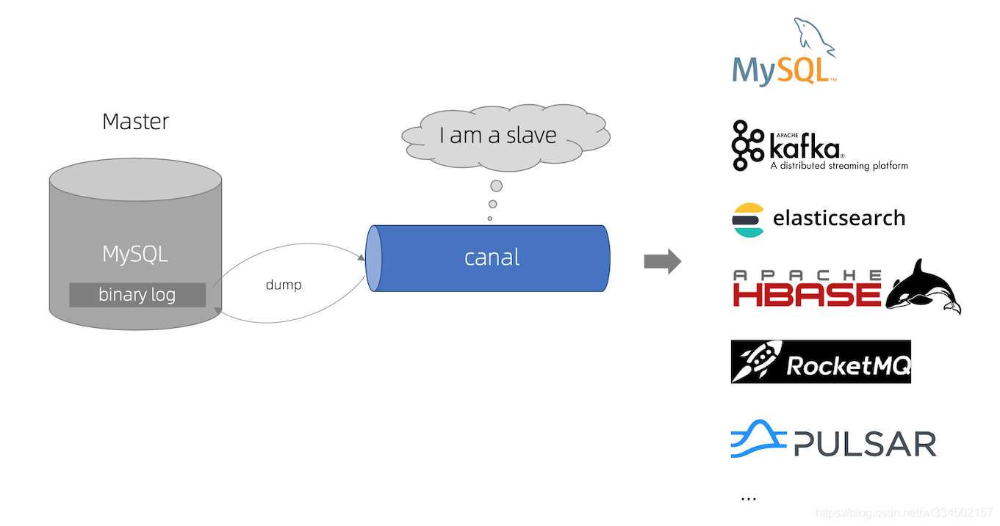

## canal简介及canal部署、原理和使用介绍

### 一、canal入门

什么是canal
阿里巴巴`B2B`公司，因为业务的特性，卖家主要集中在国内，买家主要集中在国外，所以衍生出了杭州和美国异地机房的需求，从2010年开始，阿里系公司开始逐步的尝试基于数据库的日志解析，获取增量变更进行同步，由此衍生出了增量订阅&消费的业务。

`canal`是用`java`开发的基于数据库增量日志解析，提供增量数据订阅&消费的中间件。目前，canal主要支持了`MySQL`的`binlog`解析，解析完成后才利用canal client 用来处理获得的相关数据。（数据库同步需要阿里的otter中间件，基于canal）。

这里我们可以简单地把canal理解为一个用来同步增量数据的一个工具：




`canal`通过`binlog`同步拿到变更数据，再发送到存储目的地，比如`MySQL`，Kafka，ElasticSearch等多源同步。


```java
package com.atguigu;

import com.alibaba.fastjson.JSONObject;
import com.alibaba.otter.canal.client.CanalConnector;
import com.alibaba.otter.canal.client.CanalConnectors;
import com.alibaba.otter.canal.protocol.CanalEntry;
import com.alibaba.otter.canal.protocol.Message;
import com.google.protobuf.ByteString;
import com.google.protobuf.InvalidProtocolBufferException;

import java.net.InetSocketAddress;
import java.util.List;

public class CanalClient {

    public static void main(String[] args) throws InterruptedException, InvalidProtocolBufferException {

        //TODO 获取连接
        CanalConnector canalConnector = CanalConnectors.newSingleConnector(new InetSocketAddress("hadoop102", 11111), "example", "", "");

        while (true) {

            //TODO 连接
            canalConnector.connect();

            //TODO 订阅数据库
            canalConnector.subscribe("gmall-2021.*");

            //TODO 获取数据
            Message message = canalConnector.get(100);

            //TODO 获取Entry集合
            List<CanalEntry.Entry> entries = message.getEntries();

            //TODO 判断集合是否为空,如果为空,则等待一会继续拉取数据
            if (entries.size() <= 0) {
                System.out.println("当次抓取没有数据，休息一会。。。。。。");
                Thread.sleep(1000);
            } else {

                //TODO 遍历entries，单条解析
                for (CanalEntry.Entry entry : entries) {

                    //1.获取表名
                    String tableName = entry.getHeader().getTableName();

                    //2.获取类型
                    CanalEntry.EntryType entryType = entry.getEntryType();

                    //3.获取序列化后的数据
                    ByteString storeValue = entry.getStoreValue();

                    //4.判断当前entryType类型是否为ROWDATA
                    if (CanalEntry.EntryType.ROWDATA.equals(entryType)) {

                        //5.反序列化数据
                        CanalEntry.RowChange rowChange = CanalEntry.RowChange.parseFrom(storeValue);

                        //6.获取当前事件的操作类型
                        CanalEntry.EventType eventType = rowChange.getEventType();

                        //7.获取数据集
                        List<CanalEntry.RowData> rowDataList = rowChange.getRowDatasList();

                        //8.遍历rowDataList，并打印数据集
                        for (CanalEntry.RowData rowData : rowDataList) {

                            JSONObject beforeData = new JSONObject();
                            List<CanalEntry.Column> beforeColumnsList = rowData.getBeforeColumnsList();
                            for (CanalEntry.Column column : beforeColumnsList) {
                                beforeData.put(column.getName(), column.getValue());
                            }

                            JSONObject afterData = new JSONObject();
                            List<CanalEntry.Column> afterColumnsList = rowData.getAfterColumnsList();
                            for (CanalEntry.Column column : afterColumnsList) {
                                afterData.put(column.getName(), column.getValue());
                            }

                            //数据打印
                            System.out.println("Table:" + tableName +
                                    ",EventType:" + eventType +
                                    ",Before:" + beforeData +
                                    ",After:" + afterData);
                        }
                    } else {
                        System.out.println("当前操作类型为：" + entryType);
                    }
                }
            }
        }
    }
}

```

