## Elasticsearch

### Elasticsearch概述

`Elasticsearch`，简称`es`,`es`是一个开源的==高扩展==的==分布式全文检索引擎==，它可以近乎==实时的存储、检索数据==；本身扩展性很好，可以扩展到上百台服务器，处理PB级别（大数据时代）的数据，es也是用java开发并使用Lucene作为其核心来实现所有索引和检索的功能，但是它的目的是通过简单的==RESTful API==来隐藏Lucene的复杂性，从而让全文搜索变得简单。

据国际权威的数据库产品评测机构DB Engines的统计，在2016年1月，Elasticsearch已超过Solr等，成为排名第一的搜索引擎类应用。

### ES和Solr的差别

#### Elasticsearch简介

Elasticsearch是一个实时分布式搜索和分析引擎，它让你以前所未有的速度处理大数据成为可能。

它用于全文检索、结构化搜索、分析以及将这三者混合使用。

维基百科使用Elasticsearch提供全文检索并高亮关键字，以及输入实时搜索（searche-asyou-type）和搜索纠错（did-you-mean）等搜索建议功能。

英国卫报使用Elasticsearch结合用户日志和社交网络数据提供给他们的编辑以实时的反馈，以便于及时了解公众对新发表的文章的回应。

StackOverFlow结合全文搜索和地理位置查询，以及more-like-this功能找到相关的问题和答案。

GitHub使用Elasticsearch检索1300亿行代码。

Elasticsearch是一个基于Apache Lucene(TM)的开源搜索引擎。无论在开源还是专有领域，Lucene可以被认为是迄今为止最先进、性能最好、功能最全的搜索引擎库。

但是Lucene只是一个库，想要使用它，你必须使用java来作为开发语言并将其直接集成到你的应用中，更糟糕的是，Lucene非常复杂，你需要深入了解检索的相关知识来理解它是如何工作的。

Elasticsearch也是用java开发并使用Lucene作为器核心来实现所有索引和搜索的功能，但是它的目的是通过简单的==RESTFul API==来隐藏Lucene的复杂性，从而使全文检索变得简单。

#### Solr简介

Solr是Apache下的一个顶级开源项目，采用java语言开发，它是基于Lucene的全文搜索服务器，Solr提供了比Lucene更为丰富的查询语言，同时实现了可配置、高扩展，并对索引、检索性能进行了优化。

Solr可以独立运行，运行在Jetty、Tomcat等Servlet容器中，Slor索引的实现方法很简单，用==POST方法向Solr服务器发送一个描述Field及其内容的XML文档，Solr根据xml文档添加、删除、更新索引==。Solr搜索只需要发送HTTP GET请求，然后对Solr返回xml、==json==等格式的查询结果进行解析，组织页面布局。solr不提供构建UI的功能，Solr提供了一个管理界面，通过管理界面可以查询Solr的配置和运行情况。Solr是基于Lucene开发的企业级搜索服务器，实际上就是封装了Lucene。

Solr是一个独立的企业级搜索应用服务器，它对外提供了类似==Web-Service==的API接口。用户可通过http请求，向搜索引擎服务器提交一定格式的文件，生成索引，也可以通过提出查询请求，并得到返回结果。

#### Lucene简介

Lucene是Apache软件基金会Jakarta项目组的一个子项目，是一个开放源代码的全文搜索引擎工具包，但它不是一个完整的全文检索引擎，而是一个全文检索引擎的架构，提供了完整的查询引擎和索引引擎，部分文本分析引擎（英文和德文两种西方语言）。Lucene的目的是未软件开发人员提供一个简单易用的工具包，以方便的在目标系统中实现全文检索的功能，或者是以此为基础建立简单却强大的应用程式接口，能够做全文索引和搜寻。==在java开发环境里Lucene是一个成熟的免费开源工具。就其本身而言，Lucene是当前以及最近几年最受欢迎的免费java信息检索程序库。==人们经常提到信息检索程序库，虽然和搜索引擎有关，但不应该讲信息检索程序库与搜索引擎相混淆。

Lucene是一个全文检索引擎的架构，那什么是全文搜索引擎？

全文搜索引擎是名副其实的搜索引擎，国外具代表性的有Google，国内著名的有百度（baidu），它们都是通过从互联网上提取各个网站的信息（以网页文字为主）而建立的数据库中，检索与用户查询条件相匹配的记录，然后按照一定的排列顺序将结果返回给用户。

从搜索结果来源的角度，全文搜索引擎又可分为两种，一种是拥有自己的检索程序（Indexer），俗称“蜘蛛”（Spider）程序或者”机器人“（Robot）程序，并自建网页数据库，搜索结果直接从自身的数据库中调用，如上面提及的百度和谷歌。另一种则是租用其他引擎的数据库，并按自定的格式排列搜索结果，如Lycos引擎。

#### Elasticsearch和Solr比较

1. ES基本是开箱即用，非常简单，Solr安装略微复杂一些。

2. Solr利用Zookeeper进行分布式管理，而Elasticsearch自身带有分布式协调管理功能；

3. Solr支持更多格式的数据，比如JSON、XML、CSV，而Elasticsearch仅支持JSON文件格式；

4. Solr官方提供的功能更多，而Elasticsearch本身更注重于核心功能，高级功能多有第三方插件提供，例如图形化界面需要Kibana友好支撑；

5. Solr查询快，但更新索引时慢（即插入删除慢），多用于电商等查询多的应用；

   - Elasticsearch建立索引快（即查询慢），即实时性查询快，用于Facebook、新浪等搜索；

   - Solr是传统搜索应用的有力解决方案，但Elasticsearch更适用于新兴的实时搜索应用。

6. Solr比较成熟，有一个更大、更成熟的用户、开发和贡献者社区，而Elasticsearch相对开发维护者较少，更新太快，学习使用成本较高。

​     

### Elasticsearch安装

声明：最低JDK1.8，Elasticsearch客户端，界面工具

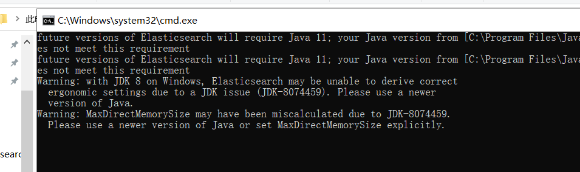

> 下载

Elasticsearch官网：https://www.elastic.co/cn/downloads/elasticsearch

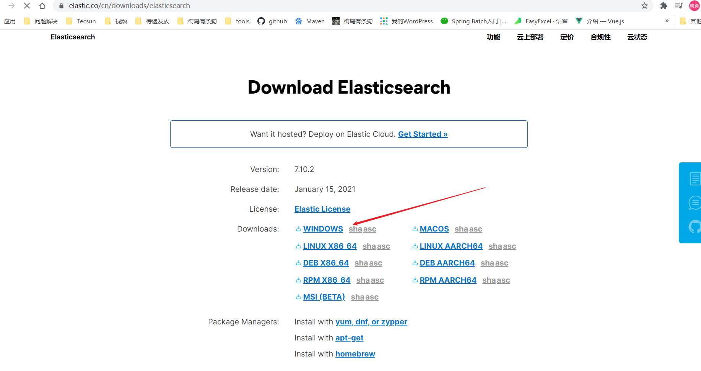


> 解压：

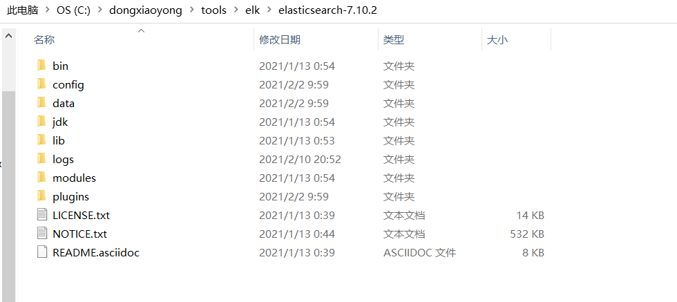

> 熟悉目录

```
bin    					启动文件
config 					配置文件
	log4j2.properties 	日志配置文件
	jvm.options 		java虚拟机相关配置
	elasticsearch.yml	Elasticsearch的配置文件，默认端口9200，使用Elasticsearch-head-master插件时要进行配置修改解决跨域问题
data					数据存储目录
logs					日志
modules					功能模块
plugins					插件  ik分词器等
	
```

> 启动

运行bin/elasearch.bat，访问http://127.0.0.1:9200

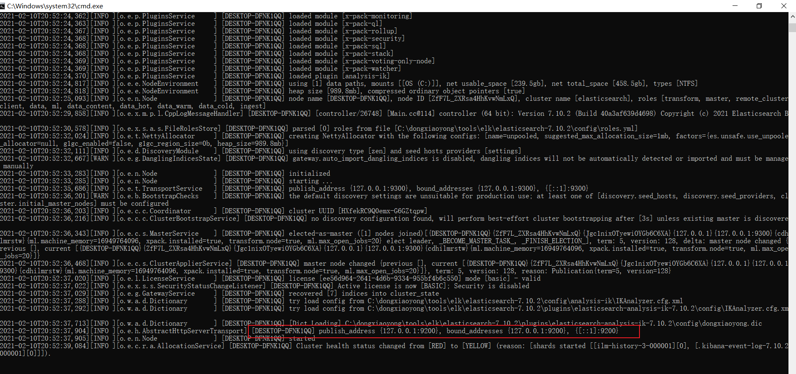

访问界面：

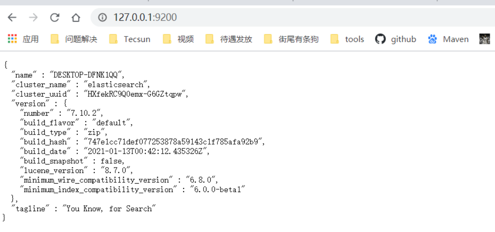

> 安装可视化管理界面（elasticsearch-head）

下载地址：https://github.com/mobz/elasticsearch-head


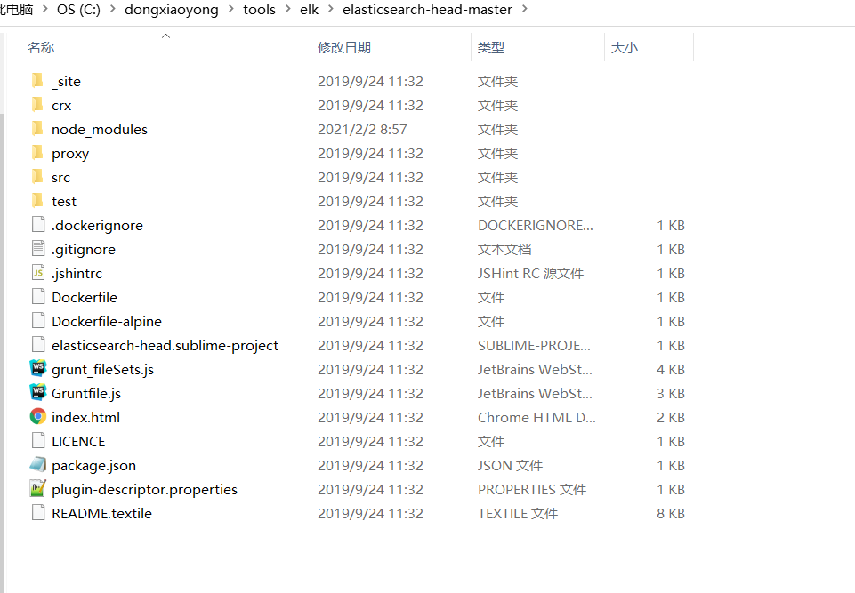

> 运行

```
npm install
npm run start
```

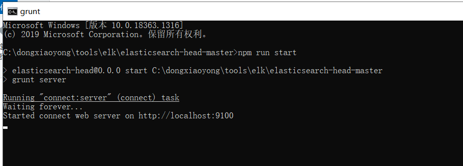

访问：http://127.0.0.1:9100/

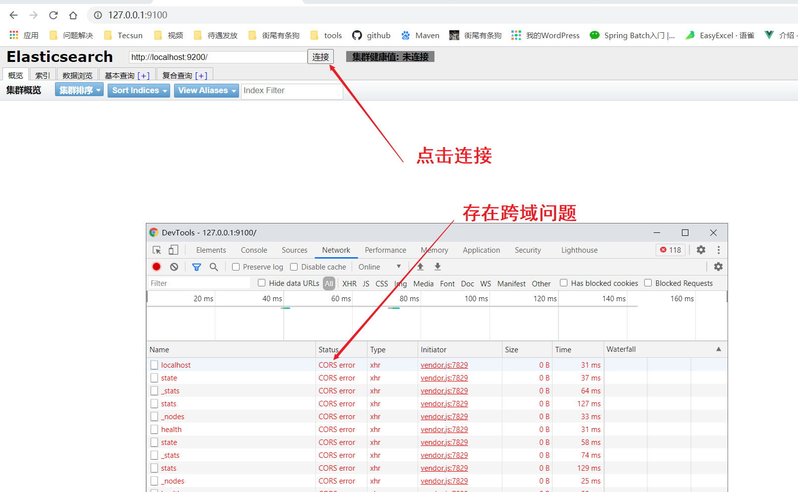

连接测试发现，存在跨域问题，修改es配置文件elasticsearch.yml，在末尾添加以下两行：

```
http.cors.enabled: true
http.cors.allow-origin: "*"
```

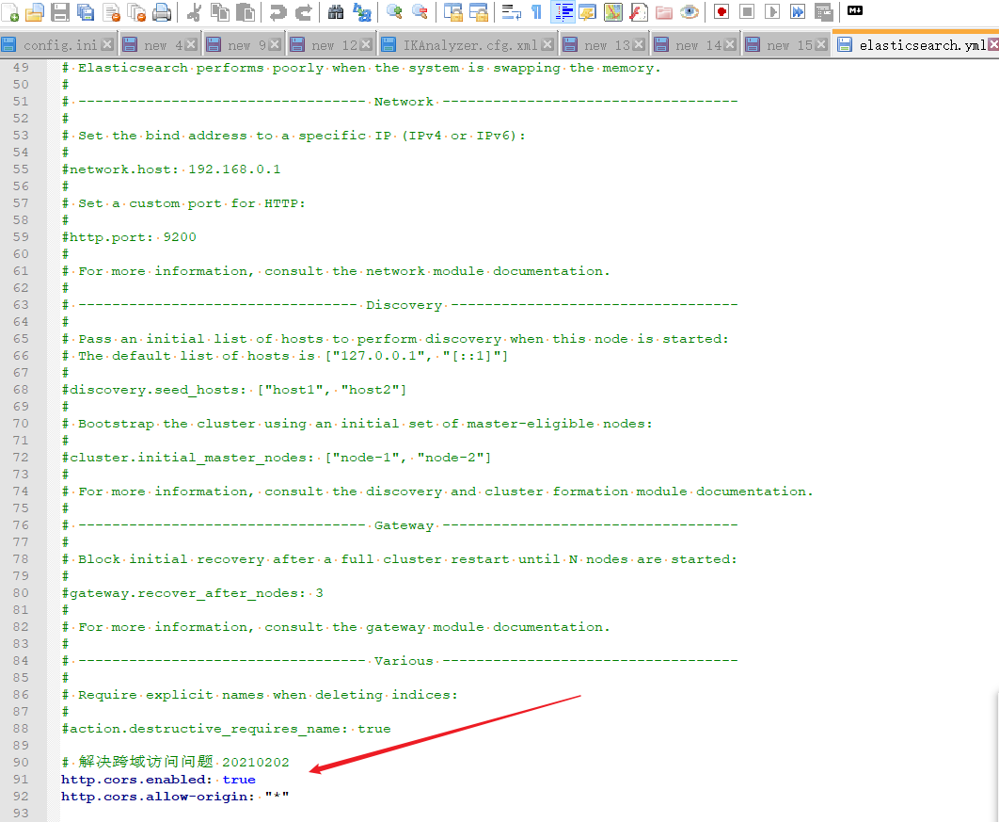

重启es，然后再次连接

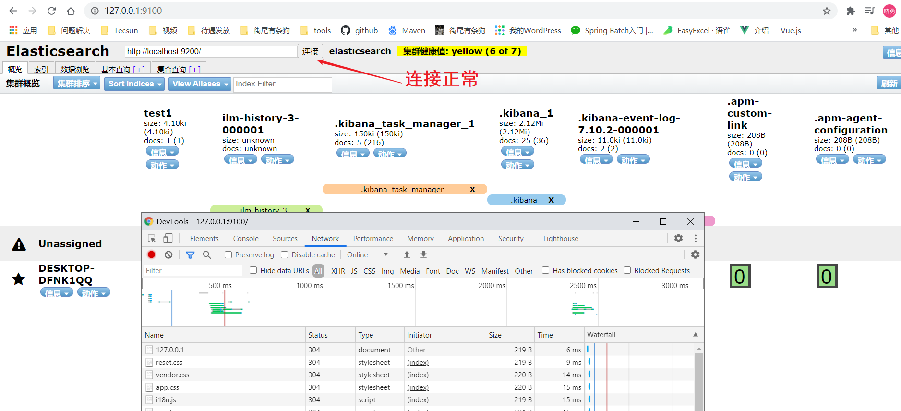


#### 了解ELK

ELK是Elasticsearch、Logstash、Kibana三大开源框架首字母大写简称。市面上也被称为Elastic Stack。其中Elasticsearch是一个基于Lucene、分布式、通过RESTFul方式进行交互的近乎实时搜索平台框架。像类似百度、谷歌这种大数据全文搜索引擎的场景都可以使用Elasticsearch作为底层支持框架，可见Elasticsearch提供的搜索能力确实强大，市面上很多时候我们简称ELasticsearch为es。Logstash是ELK的中央数据流引擎，用于从不同目标（文件/数据存储/MQ）收集的不同格式数据，经过过滤后支持输出到不同目的地（文件/MQ/redis/elasticsearch/kafka等）。Kibana可以将Elasticsearch的数据通过友好的页面展示出来，提供实时分析的功能。

市面上很多开发只要提到ELK能够一致说出它是一个日志分析架构技术栈总称，但实际上ELK不仅仅适用于日志分析，它还可以支持其他任何数据分析和收集的场景，日志分析和收集只是更具代表性，并非唯一性。

收集清洗数据Logstash ------> 搜索、存储Elasticsearch -----> 展示、分析 Kibana

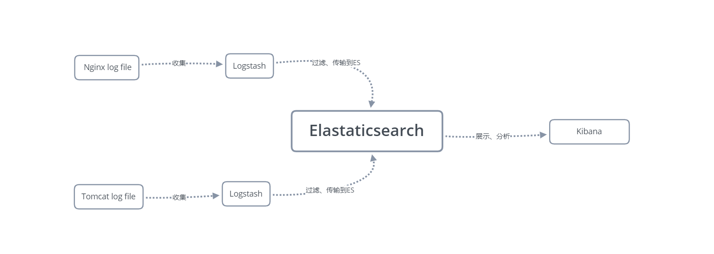

> 安装Kibana

Kibana是一个针对Elasticsearch的开源分析及可视化平台，用来搜索、查看交互存储在ELasticsearch索引中的数据。使用Kibana，可以通过各种图表进行高级数据分析及展示。Kibana让海量数据更容易理解。它操作简单，基于浏览器的用户界面可以快速创建仪表板（dashboard）实时显示Elasticsearch查询动态。设置Kibana非常简单。无需编码或者额外的基础架构，几分钟内就可以完成Kibana安装并启动Elasticsearch索引检测。

官网：https://www.elastic.co/cn/kibana

Kibana版本要和Elasticsearch版本一致

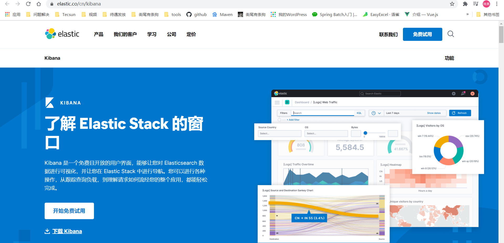

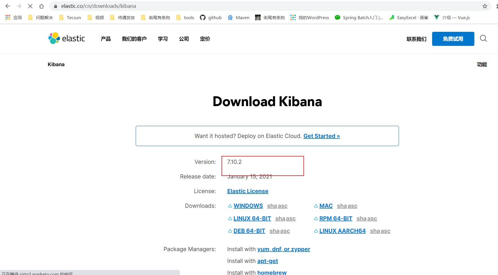


解压：

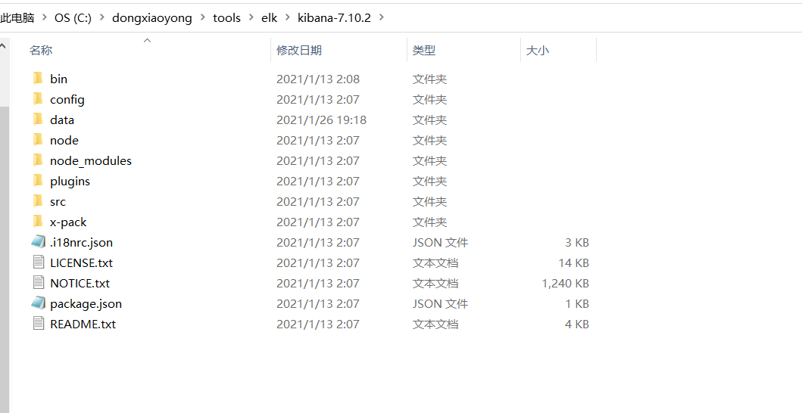

启动：bin/kibana.bat

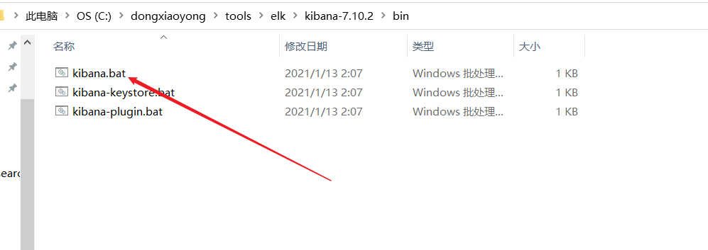

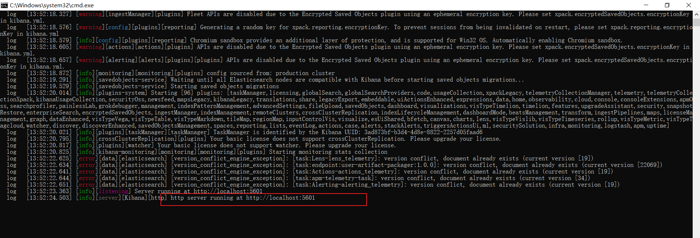

访问：http://127.0.0.1:5601

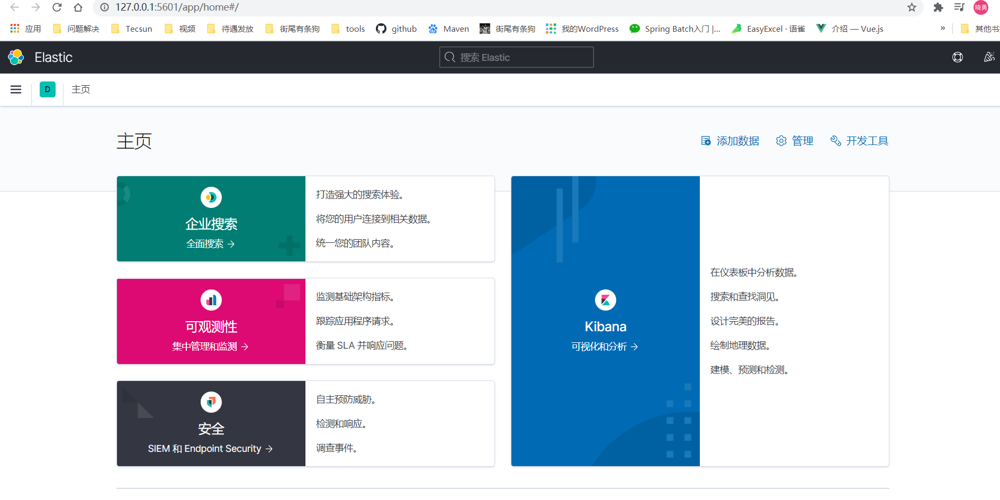

这里已经修改了配置文件kibana.yml，使得汉化提示更加友好

```
i18n.locale: "zh-CN"
```


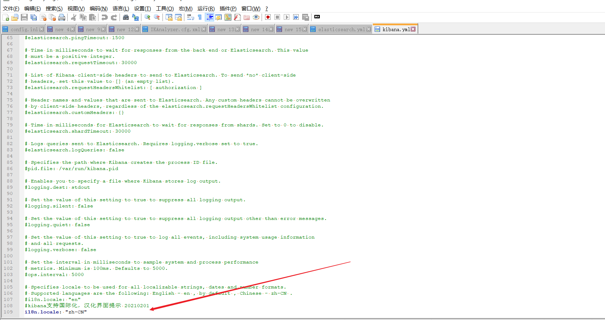


### ES核心概念

1. 索引
2. 字段类型
3. 文档

> Elasticsearch是面向文档的，下面是关系型数据库和Elasticsearch的客观比对，一切都是JSON

|  Relational DB    |   ELasticsearch   |
| ---- | ---- |
|  数据库（database）    |  索引（indices）    |
|  表（tables）    | types ==慢慢被弃用==     |
|  行（rows）    |  文档（documents）    |
|  列（columns）  | 字段（fields）     |

Elasticsearch（集群）中可以包含多个索引（数据库），每个索引中可以包含多个类型（表），每个类型下又包含多个文档（行），每个文档中又包含多个字段（列）

##### 物理设计：

Elasticsearch在后台把每个**索引划分成多个分片**，每个分片可以在集群中的不同服务器间迁移

一个人就是一个集群，默认的集群名称就是`elasticsearch`

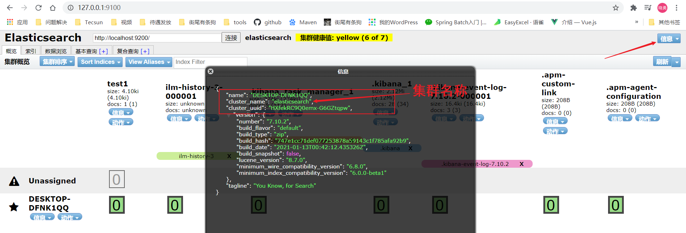


##### 逻辑设计：

一个索引类型中，包含多个文档，比如说文档1、文档2。当我们索引一篇文档时，可以通过这样的一个顺序找到它：索引 --> 类型 --> 文档ID，通过这个组合我们就能索引到某个具体的文档。==注意：ID不必是整数，实际上它是个字符串。==

> 文档

==就是一行行的数据==

之前说ELasticsearch是面向文档的，那么就意味着索引和搜索数据的最新单位是文档，Elasticsearch中，文档有几个重要属性：

- 自我包含，一篇文档同时包含字段和对应的值，也就是==key:value== 键值对的格式；

- 可以是层次型的，一个文档中包含子文档，复杂的逻辑实体就是这么来的；

- 灵活的结构，文档不依赖预先定义的模式，我们知道关系型数据库中，要提前定义字段才能使用，在ELasticsearch中，对于字段是非常灵活的，有时候，我们可以忽略该字段，或者动态的添加一个新的字段；

  

尽管我们可以随意的新增或者忽略某个字段，但是，每个字段的类型非常重要，比如一个年龄字段类型，可以是字符串也可以是整形。因为ELasticsearch会保存字段和类型之间的映射及其他的设置。这种映射具体到每个映射的每种类型，这也是为什么在ELasticsearch中，类型有时候也称为映射类型。

> 类型

==就是列类型==

类型是文档的逻辑容器，就像是关系型数据库一样，表格是行的容器。类型中对于字段的定义称为映射，比如name映射未字符串类型。我们数文档是无模式的，它们不需要拥有映射所定义的所有字段，比如新增一个字段，那么Elasticsearch是怎么做的呢？Elasticsearch会自动的将新字段加入映射，但是这个字段的不确定是什么类型，Elasticsearch就开始自动定义，如果这个值是18，那么Elasticsearch会认为它是整形。但是Elasticsearch也可能自定义不对，所以最安全的方式就是提前定义好所需要的映射，这点和关系型数据库殊途同归了，先定义好字段，然后再使用。

> 索引

==就是数据库==

索引是映射类型的容器，Elasticsearch中的索引是一个非常强大的文档集合。索引存储了映射类型的字段和其他设置。然后它们被存储到了各个分片上了。下面说明下分片是如何工作的。

##### 物理设计：节点和分片如何工作

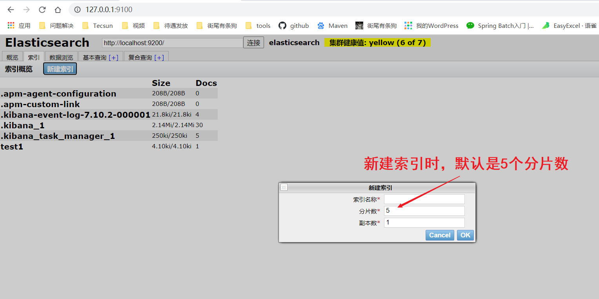

一个集群至少有一个节点，而一个节点就是一个Elasticsearch进程，节点可以有多个索引默认的，如果你创建索引，那么索引将会有5个分片（primary shard，又称主分片）构成的，每一个主分片会有一个副本（replica shard，又称复制分片）

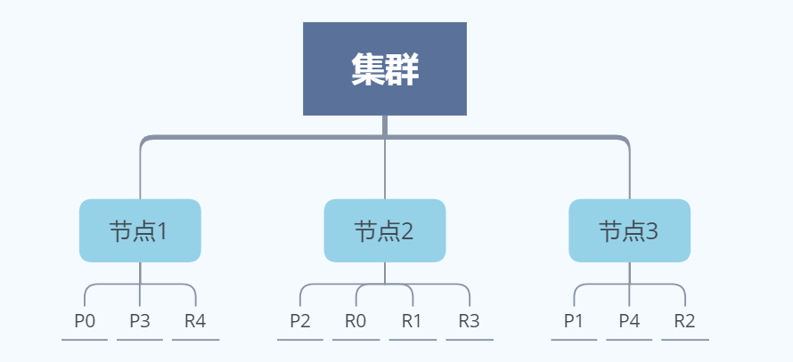

上图是一个有3个节点的集群，可以看到主分片和对应的复制分片都不会再同一个节点内，这样利于某个节点挂掉了，数据也不至于丢失。实际上，一个分片是一个Lucene索引，一个包含==倒排索引==的文件目录，==倒排索引==的结构使得Elasticsearch在不扫描全部文档的情况下，就能告诉你哪些文档包含特定的关键字。

> 倒排索引

倒排索引（Inverted Index）也叫反向索引，有反向索引必有正向索引。通俗地来讲，正向索引是通过key找value，反向索引则是通过value找key。Elasticsearch使用的是倒排索引的结构，采用Lucene倒排索引作为底层。这种结构适用于快速的全文搜索，一个索引由文档中所有不重复的列表构成，对于每一个词，都有一个包含它的文档列表。例如，现在有两个文档，每个文档包含如下内容：

```json
Study every day,good good up to forever	#文档1包含的内容
To forever, study every day,good good up #文档2包含的内容
```

为了创建倒排索引，我们首先要将每个文档拆分成独立的词（或称为词条或者tokens），然后创建一个包含所有不重复的词条的排序列表，然后列出每个词条出现在 哪个文档：

| term    | doc_1 | doc_2 |
| ------- | ----- | ----- |
| Study   | √     | ×     |
| To      | ×     | √     |
| every   | √     | √     |
| forever | √     | √     |
| day     | √     | √     |
| study   | ×     | √     |
| good    | √     | √     |
| to      | √     | ×     |
| up      | √     | √     |

现在，我们试图搜索 to forever，只需查看包含每个词条的文档，选择权重(`scoer`)高的返回

| term    | doc_1 | doc_2 |
| ------- | ----- | ----- |
| to      | √     | ×     |
| forever | √     | √     |
| total   | 2     | 1     |

两个文档都匹配，但是第一个文档比第二个文档的匹配程度更高。如果没有别的条件，现在，这两个包含关键字的文档都将返回。再来看一个示例，比如我们通过博客标签来搜索博客文章。那么倒排索引列表就是这样的一个结构：

<table>
    <tr>
        <th colspan="2" align="center">博客数据(原始数据)</th>
        <th colspan="2" align="center">索引列表(倒排索引)</th>
    </tr>
    <tr>
    	<td align="center">博客文章ID</td>
        <td align="center">标签</td>
        <td align="center">标签</td>
        <td align="center">博客文章ID</td>
    </tr>
    <tr>
    	<td align="center">1</td>
        <td align="center">python</td>
        <td align="center">python</td>
        <td align="center">1,2,3</td>
    </tr>
    <tr>
        <td align="center">2</td>
        <td align="center">python</td>
        <td align="center">linux</td>
        <td align="center">3,4</td>
    </tr>
    <tr>
        <td align="center">3</td>
    	<td align="center">linux,python</td>
        <td align="center"></td>
        <td align="center"></td>
    </tr>
    <tr>
    	<td align="center">4</td>
        <td align="center">linux</td>
        <td align="center"></td>
        <td align="center"></td>
    </tr>
</table>

如果要搜索含有python标签的文章，那相对应查找所有原始数据而言，查找倒排索引后的数据会快很多。只需要查看标签这一栏，然后获取相关的文章ID即可。完全过滤掉无关其他数据，提高搜索效率；

**Elasticsearch索引和Lucene索引的对比**

在Elasticsearch中，索引(库)这个词被频繁的使用，这就是术语的使用。在Elasticsearch中，索引被分为多个分片，每个分片是一个Lucene的索引。所以==一个Elasticsearch索引是由多个Lucene索引组成的==，因为Elasticsearch使用Lucene作为底层。如无特指，说起索引都是指Elasticsearch的索引

接下来的一切操作都在Kibana的DevTools下的Console里完成。

### IK(elasticsearch-analysis-ik)分词器插件

> 什么是分词器？

分词：即把一段中文或者英文等字符划分为一个个的关键字，我们在搜索的时候会把自己的信息进行分词，会把数据库中或者索引库中 的数据进行分词，然后进行一个匹配操作，默认的中文分词器是将每个字看成一个词，比如”我爱狂神“，会被分成“我”，“爱“，”狂“，”神“。

`IK`提供了两个分词算法，`ik_smart` 和`ik_max_word`，其中`ik_smart`为最少切分，`ik_max_word`为最小粒度切分。 

> 安装

1. 下载地址：https://github.com/medcl/elasticsearch-analysis-ik/releases

2. 下载完毕之后，放到`Elasticsearch`的插件目录`plugins`

   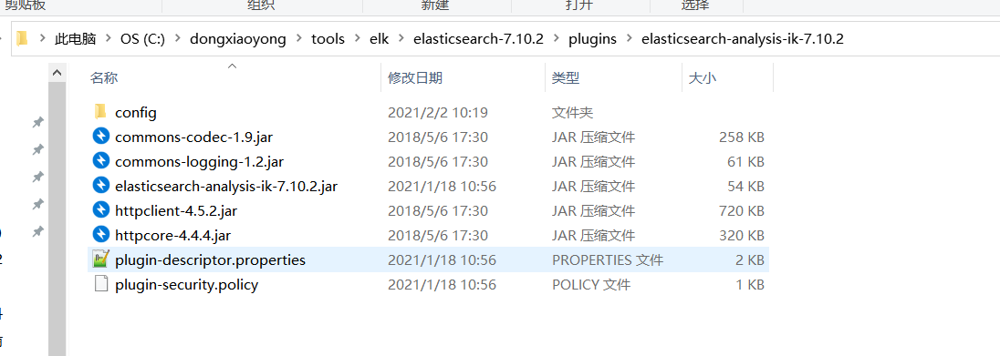

3. 重启观察`Elasticsearch`，可以看到`ik`分词器被加载了

   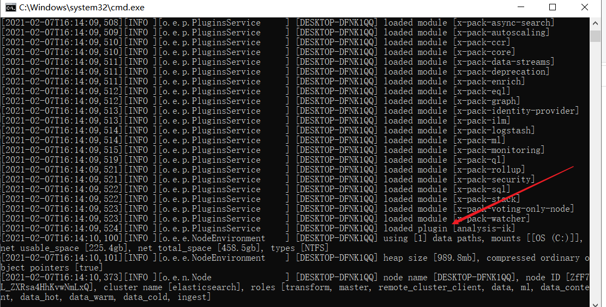

4. 验证

   ```shell
   # 可以通过这个命令来查看加载进来的插件
   elasticsearch-plugin list
   ```

   看到加载的插件清单中包含了 `ik`分词器

   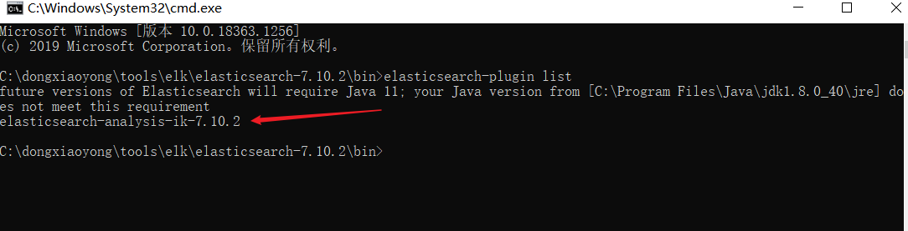

5. 使用`kibana`验证

   > 查看不同分词器的分词效果

   - `ik_smart`

     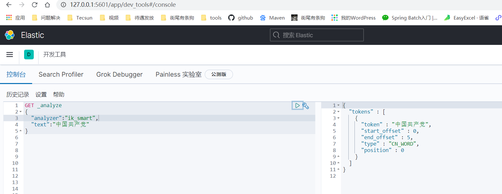

   - `ik_max_word` ，最小粒度划分，穷尽词库的可能

     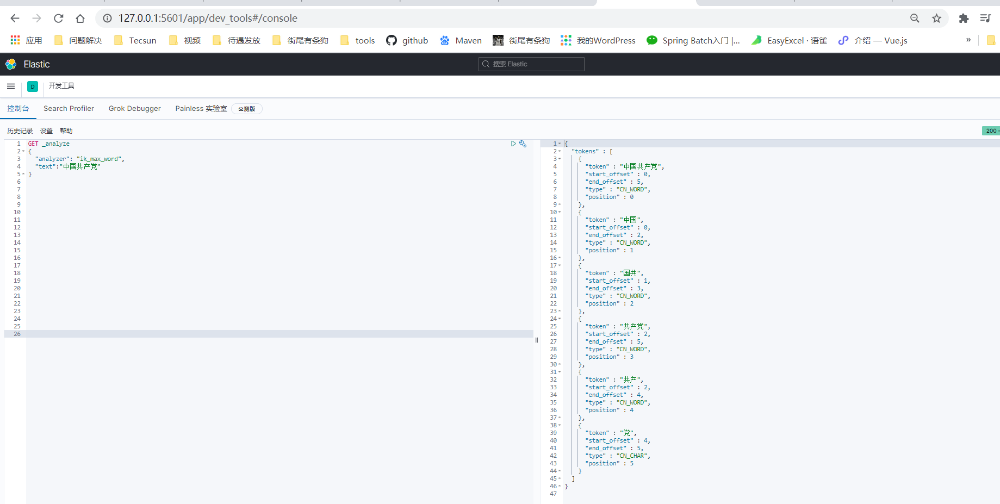

> 添加自定义字典

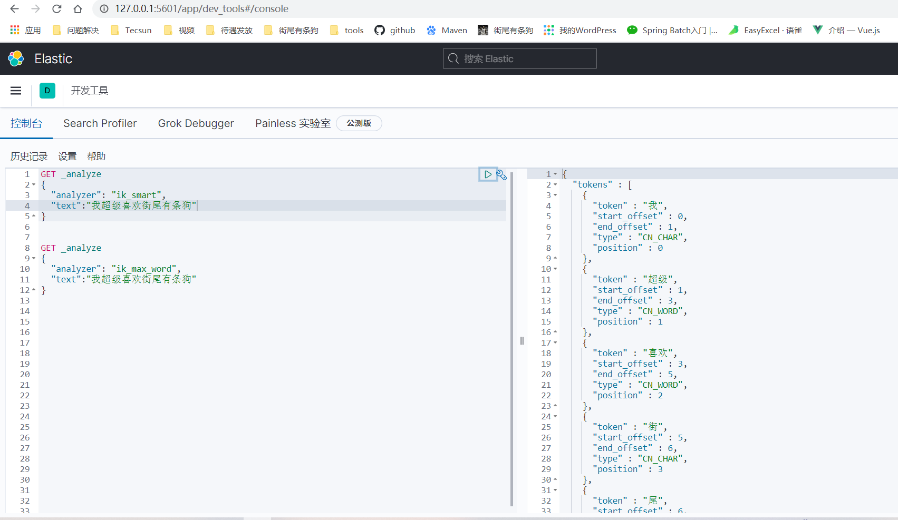


ik分词器的config目录中添加自定义字典文件`dongxiaoyong.dic`，在文件中添加字典词语,并修改ik分词器的配置文件`IKAnalyzer.cfg.xml`，指明字典文件路径

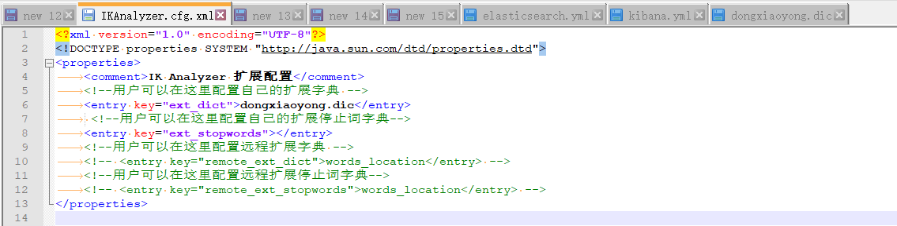

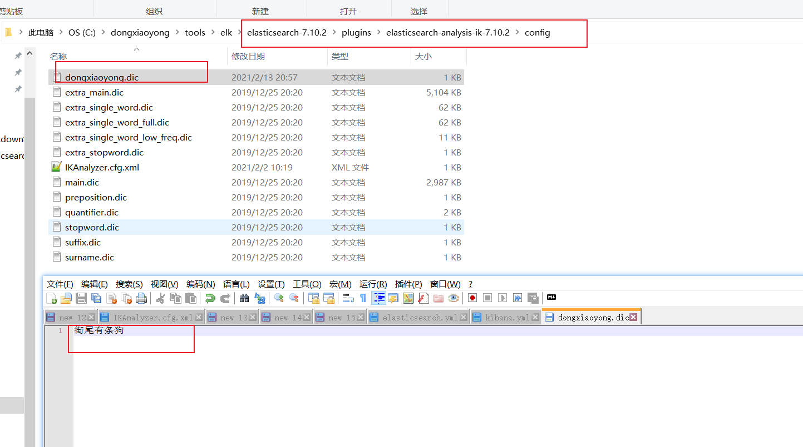

重启Elasticsearch，再次执行分词效果如下：

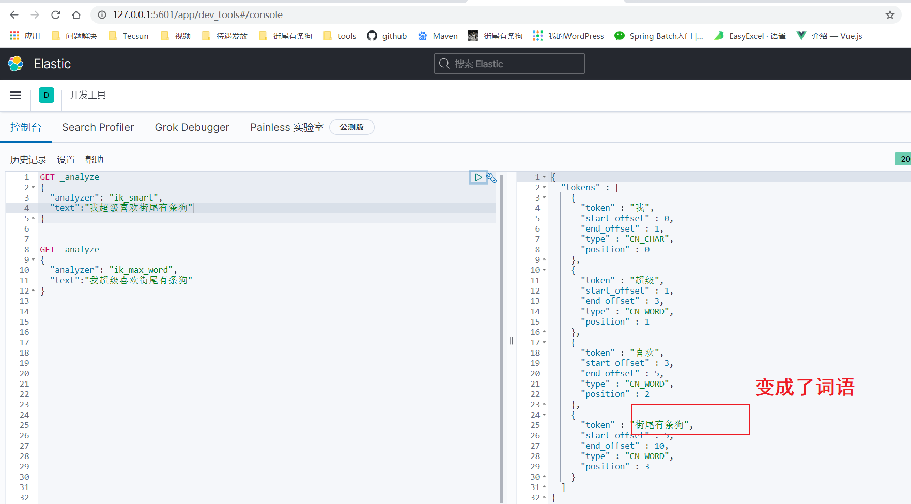

以后的话，我们需要自己配置分词就在自己定义的dic文件中进行配置即可。

### Rest风格说明

一种软件架构风格，而不是标准，只是提供了一组设计原则和约束条件，它主要用于客户端和服务器交互类的软件，基于这个风格设计的软件可以更简洁，更有层次，更易于实现缓存等机制。

基本Rest命令说明

method|url地址|描述
--|--|--
PUT|localhost:9200/索引名/类型名称/文档id|创建文档（指定文档id）
POST|localhost:9200/索引名称/类型名称|创建文档（随机文档id）
POST|localhost:9200/索引名称/类型名称/文档id/_update|修改文档
DELETE|localhost:9200/索引名称/类型名称/文档id|删除文档
GET|localhost:9200/索引名称/类型名称/文档id|通过文档id查询文档
POST|localhost:9200/索引名称/类型名称/_search|查询所有数据

> 基础测试（使用**kibana**操作） http://localhost:5601

1. ##### 创建一个索引

```
PUT /索引名称/~类型名称~/文档id
{
	请求体
}
```

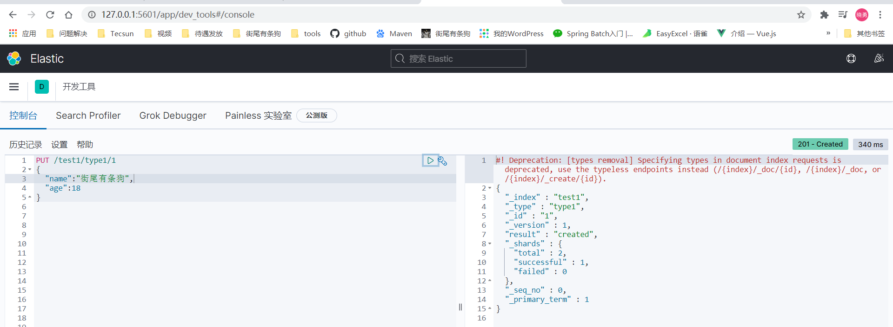

2. 在Elasticsearch-head界面可以看到索引和数据都已经成功创建

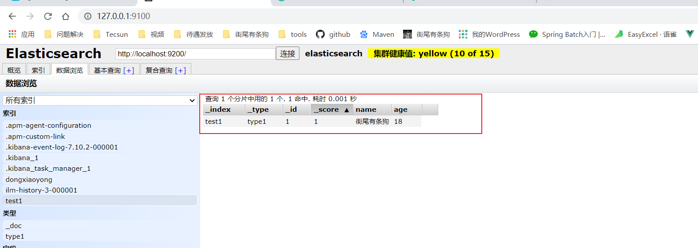

3. 那么name这个字段用不用指定类型呢，类比与关系型数据库中的列

   - 字符串类型

     <u>text</u>、<u>keyword</u>

   - 数值类型
     <u>long</u>,<u>integer</u>,<u>short</u>,<u>byte</u>,<u>double</u>,<u>float</u>,<u>halffloat</u>,<u>scaledfloat</u>
     
   - 日期类型
     <u>date</u>
   - 布尔值类型
     <u>boolean</u>
   - 二进制类型
     <u>binary</u>
   - 等等......

4. 指定字段的类型

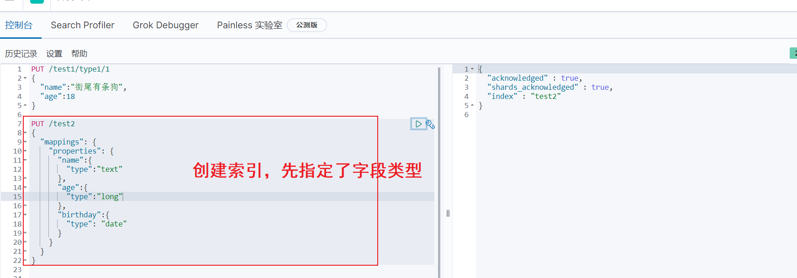

获取这个规则，可以通过GET请求获取索引或者文档信息

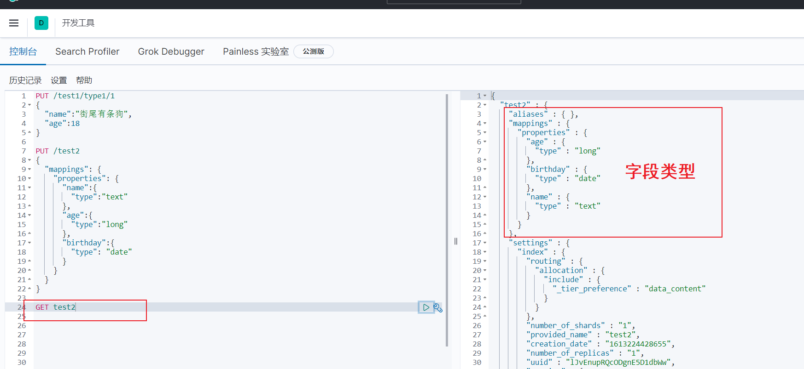

5. 默认类型

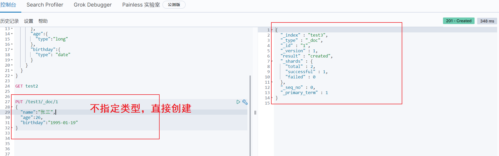

如果自己的文档字段没有指定，那么ELasticsearch就会给我们默认配置字段类型

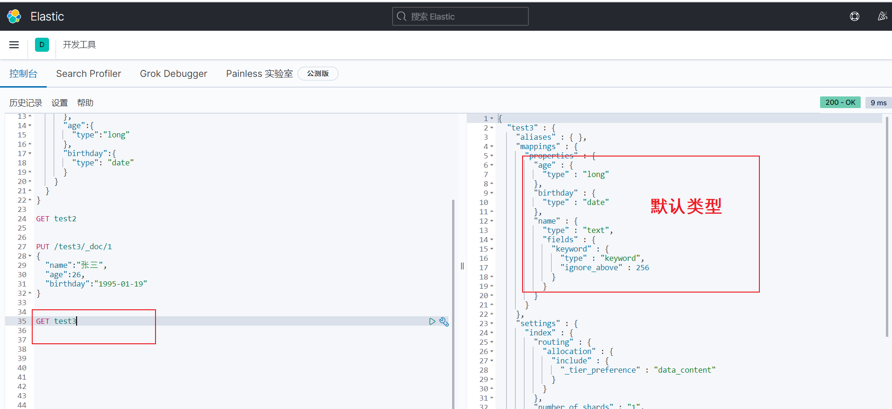

> 扩展，通过命令 `GET_cat/` 获取当前Elasticsearch信息

1. `GET _cat/health?v` 

   获取es集群的健康状况


返回信息

| 返回字段           | 原文 | 含义 |
| ------------------ | ---- | ---- |
| epoch              | seconds since 1970-01-01 00:00:00 | 自标准时间(1970-01-01 00:00:00)以来的秒数 |
| timestamp          | time in HH:MM:SS | 时分秒，utc时区 |
| cluster            | cluster name | 集群名称 |
| status             | health status | 集群状态 |
| node.total         | total number of nodes | 节点总数 |
| node.data          | number of nodes that can store data | 数据节点总数 |
| shards             | total number of shards | 分片总数 |
| pri                | number of primary shards | 主分片总数 |
| relo               | number of relocating nodes | 复制节点总数 |
| init               | number of initializing nodes | 初始化节点总数 |
| unassign           | number of unassigned shards | 未分配分片总数 |
| pending_tasks      | number of pending tasks | 待定任务总数 |
| max_task_wait_time | wait time of longest task pending | 等待最长任务的等待时间 |
| active_shards_percnet | active number of shards in percent | 激活分片百分比 |


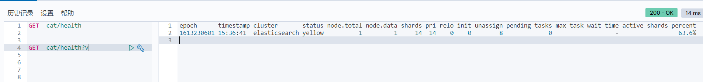

2. `GET _cat/indices` 

   获取索引库信息

| 返回字段       | 原文                               | 含义                  |
| -------------- | ---------------------------------- | --------------------- |
| health         | current health status              | 索引健康状态          |
| status         | open/close status                  | 索引的开启状态        |
| index          | index name                         | 索引名称              |
| uuid           | index uuid                         | 索引uuid              |
| pri            | number of primary shards           | 索引主分片数          |
| rep            | number of replica shards           | 索引副本分片数量      |
| doc.count      | available docs                     | 索引中文档总数        |
| doc.deleted    | deleted docs                       | 索引中删除状态的文档  |
| store.size     | store size of primaries & replicas | 主分片+副本分片的大小 |
| pri.store.size | store size of primaries            | 主分片的大小          |

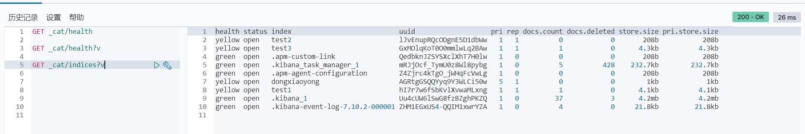

3. `GET _cat/master`

    获取master节点信息

   返回信息：

| 返回字段 | 原文       | 含义     |
| -------- | ---------- | -------- |
| id       | node id    | 节点id   |
| host     | host name  | 主机     |
| ip       | ip address | ip地址   |
| node     | node name  | 节点名称 |


4. `GET _cat/nodeattrs` 

   获取节点属性信息

   返回信息：

   | 返回字段 | 原文                  | 含义     |
   | -------- | --------------------- | -------- |
   | node     | node name             | 节点名称 |
   | host     | host name             | 主机     |
   | ip       | ip address            | ip地址   |
   | attr     | attribute description | 属性描述 |
   | value    | attribute value       | 属性值   |

   

   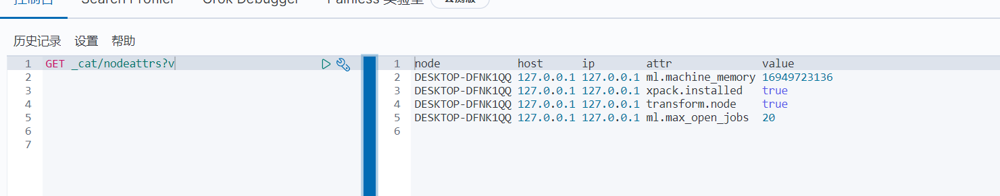

5. `GET _cat/nodes?v`

   获取节点信息

返回信息：

| 返回字段     | 原文                                                         | 含义             |
| ------------ | ------------------------------------------------------------ | ---------------- |
| ip           | ip address                                                   | ip地址           |
| heap.percent | used heap                                                    | 堆内存占用百分比 |
| ram.percent  | used machine memory ratio                                    | 内存占用百分比   |
| cpu          | recent cpu                                                   | CPU占用百分比    |
| load_1m      | 1m load avg                                                  | 1分钟的系统负载  |
| load_5m      | 5m load avg                                                  | 5分钟的系统负载  |
| load_15m     | 15m load avg                                                 | 15分钟的系统负载 |
| node.role    | m:master eligible node, d:data node, i:ingest node, -:coordinating node only | node节点的角色   |
| master       | *:current master                                             | 是否是master节点 |
| name         | node name                                                    | 节点名称         |

