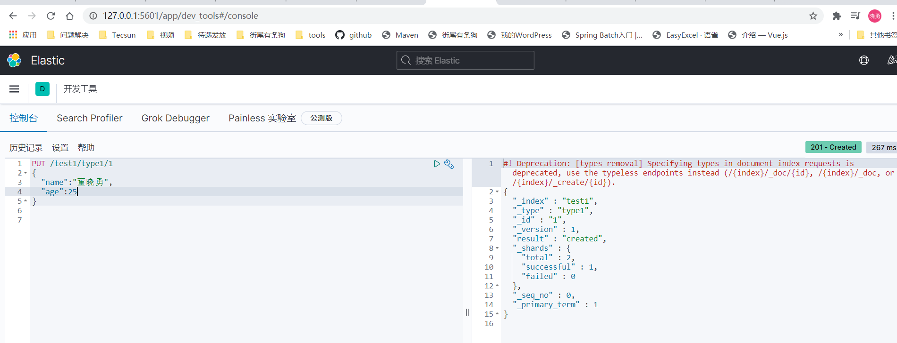
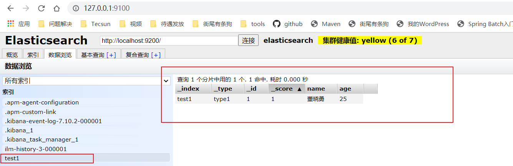

## Elasticsearch

### Elasticsearch概述

### ES和Solr的差别

### Elasticsearch安装

### ES核心概念

### IK(elasticsearch-analysis-ik)分词器插件

### Rest风格说明

一种软件架构风格，而不是标准，只是提供了一组设计原则和约束条件，它主要用于客户端和服务器交互类的软件，基于这个风格设计的软件可以更简洁，更有层次，更易于实现缓存等机制。

基本Rest命令说明

method|url地址|描述
--|--|--
PUT|localhost:9200/索引名/类型名称/文档id|创建文档（指定文档id）
POST|localhost:9200/索引名称/类型名称|创建文档（随机文档id）
POST|localhost:9200/索引名称/类型名称/文档id/_update|修改文档
DELETE|localhost:9200/索引名称/类型名称/文档id|删除文档
GET|localhost:9200/索引名称/类型名称/文档id|通过文档id查询文档
POST|localhost:9200/索引名称/类型名称/_search|查询所有数据

> 基础测试（使用**kibana**操作） http://localhost:5601

1. ##### 创建一个索引

```
PUT /索引名称/~类型名称~/文档id
{
	请求体
}
```



在Elasticsearch-head界面可以看到索引和数据都已经成功创建

