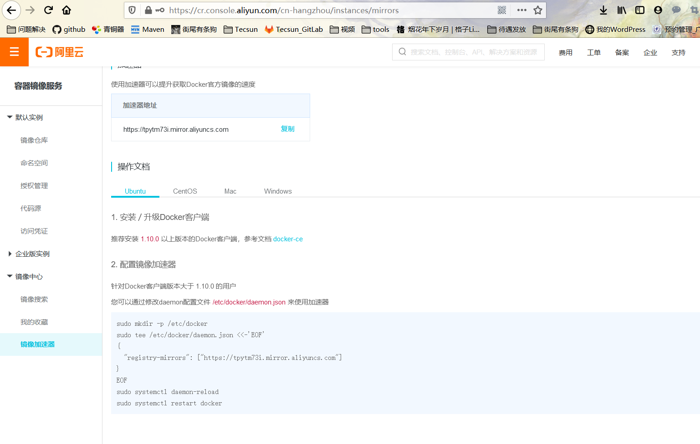

## Docker学习概要

> **Docker学习**

- Docker概述
- Docker安装
- Docker命令
  - ​	镜像命令
  - 容器命令
  - 操作命令
  - ...

- Docker镜像

- 容器数据卷

- DockerFile

- Docker网络原理

- IDEA整合Docker

- Docker Compose Docker 集群

- Docker Swarm 简化版的K8s

- CI\CD (持续集成、持续交付) Jenkins

  

## Docker概述

### Docker为什么会出现？

一款产品：开发--上线 两套环境，应用环境，应用配置

开发---运维。问题

官网：https://www.docker.com/get-started


#### 安装docker

###### 准备工作

Docker官方建议将Docker安装在Linux操作系统上。当然，Docker也可运行在其他的平台，例如Windows、Mac OS等。

这里演示的是在CentOS上安装Docker，其他操作系统上的安装可以参考官方文档：https://docs.docker.com/docker-for-windows/install/

1. **系统要求**

- Docker运行在CentOS 7.X至上。

- Docker需要安装在64位平台上。

2. **移除非官方软件包**

**Red Hat**操作系统包含了一个旧版本的Docker软件包，该旧版本软件包的名称是"docker"，新版本是"docker-engine"。因此，如已安装该软件包，那么需要执行以下命令移除。

```shell
sudo yum -y remove docker
```

执行该命令只会移除旧版本的Docker，/var/lib/docker目录中的内容不会被删除，因此，旧版本Docker所创建的镜像、容器、卷等都会保留下来。

3. **设置yum源**

Docker有多种安装方式，例如yum安装、rpm包安装、shell安装等，这里以yum安装为例。

1. **安装yum-utils，这就能使用yum-config-manager工具设置yum源。**

   ```shell
   sudo yum install -y yum-utils
   ```

2. **执行以下命令，添加Docker的yum源。**

   ```shell
   sudo yum-config-manager \ --add-repo \ https://docs.docker.comn/engine/installation/linux/repo_files/repo_files/centos/docker.repo
   ```

3. **[可选]启用测试**

   測試仓库包含在docker.repo文件中，但默认情况下是禁用的。如需启用测试仓库，可使用以下命令：

   ```she
   sudo yum-config-manager --enable docker-testing
   ```

   如要禁用测试仓库，可执行以下命令：

   ```shell
   sudo yum-config-manager --disable docker-testing
   ```

   #### 安裝Docker具体步骤

   1. **更新yum包的索引。**

      ```shell
      sudo yum makecache fast
      ```

   2. **安装最新版本的Docker。**

      ```shel
      sudo yum -y install docker-engine
      ```

      这样，经过一段时间的等待后，Docker就安装成功了。

   3. 在生产系统中，可能需要安装指定版本的Docker，而并不总是安装最新版本。执行以下命令，即可列出可用的Docker版本。

      ```shel
      yum list docker-engine.x86_64 --showduplicate | sort -r
      ```

      其中，`sort -r`命令表示对结果由高到低排序。执行后，可看到类似于如下的表格：

      | docker-engine.x86_64     | 1.13.0-1.e17.centos     | docker-main     |
      | ------------------------ | ----------------------- | --------------- |
      | **docker-engine.x86_64** | **1.12.6-1.e17.centos** | **docker-main** |
      | **docker-engine.x86_64** | **1.12.5-1.e17.centos** | **docker-main** |
      | **...**                  |                         |                 |

      该表格有三列，第一列是软件包名称，第二列是版本名字符串，第三列是仓库名称，表示软件包的存储位置，例如`docker-main`、`docker-testing`等。列出`Docker`版本后，可使用以下命令安装指定版本的`Docker`。

      ```shell
      sudo yum -y install docker-engine-<VERSION STRING>
      ```

      例如：

      ```shell
      sudo yum -y install docker-engine-1.13.0
      ```

   4. **启动Docker**

      ```shell
      sudo systemctl start docker
      ```

   5. 执行以下命令，验证安装是否正确。

      ```shell
      sudo docker -run hello-world
      ```

      如看到类似于如下的结果，则说明安装正确。

      ```shell
      unable to find image 'hello-world:latest' locally
      ...
      Hello from Docker!
      This message shows that your installaltion appears to be working correctly.
      ...
      ```

   6. **查看Docker版本**

      ```shell
      docker version
      ```

      可看到类似于如下的结果：

      ```shell
      Client:
      	version:	1.13.0
      	API version:	1.25
      	Go version:	go1.7.3
      	Git commit:	49bf474
      	Built:	TUe Jan 17 09:55:28 2017
      	OS/ArchL	linux/amd64
      Server:
      	version:	1.13.0
      	API version:	1.25(minimum version 1.12)
      	Go version:	go1.7.3
      	Git commit:	49bf474
      	Built:	TUe Jan 17 09:55:28 2017
      	OS/ArchL	linux/amd64
      	Experimental:	false
      
      ```

      由结果可知当前Docker版本、API版本、Go语言版本等信息。

#### 卸载Docker

1. **卸载Docker软件包**

   ```shell
   sudo yum -y remove docker-engine
   ```

2. **如需删除镜像、容器、卷以及自定义的配置文件，可执行以下命令：**

   ```shell
   sudo rm -rf /var/lib/docker
   ```

#### 配置镜像加速器

国内访问`Docker Hub`的速度很不稳定，有时甚至出现连接不上的情况。接下来为`Docker`配置镜像加速器，从而解决这个问题。目前国内很多云服务商都提供镜像加速的服务。常用的镜像加速器有：阿里云加速器、`DaoCloud`加速器等。各厂商镜像加速器的使用方式大致类似，下面以阿里云加速器为例进行讲解。

1. 注册阿里云账号后，即可在阿里云控制台：（https://cr.console.aliyun.com/cn-hangzhou/instances/mirrors）看到如下图所示的页面



2.  参照上图说明，即可配置镜像加速器

```she
sudo mkdir -p /etc/docker
sudo tee /etc/docker/daemon.json <<-'EOF'
{
  "registry-mirrors": ["https://tpytm73i.mirror.aliyuncs.com"]
}
EOF
sudo systemctl daemon-reload
sudo systemctl restart docker
```

