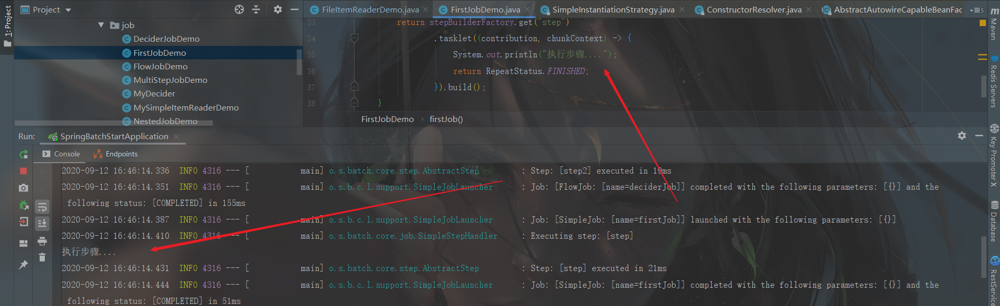
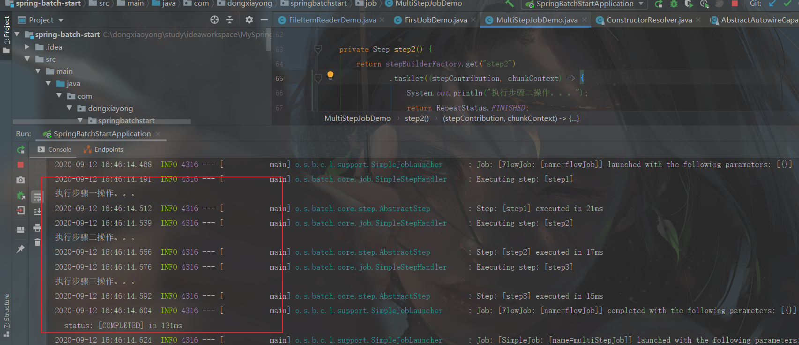
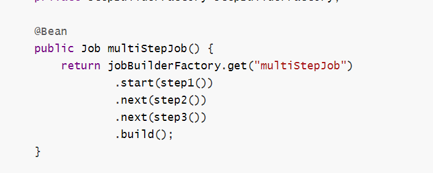
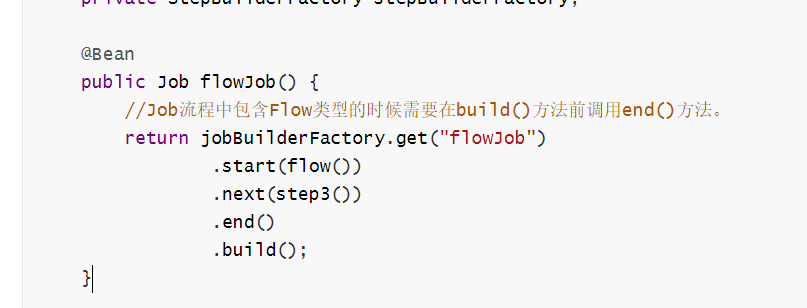

## 一、Spring Batch入门

企业中经常会有需要批处理才能完成的业务操作，比如：自动化的处理大批量复杂的数据，如月结计算；重复性的处理大批量数据，如费率计算；充当内部系统和外部系统的数据纽带，中间需要对数据进行格式化，校验，转换处理等。

`Spring Batch`是一个轻量级但功能又十分全面的批处理框架。下面通过一个简单的例子来入门`Spring Batch`。

### 框架搭建

新建一个`Spring Boot`项目，版本为`2.3.2.RELEASE`, `artifactId`为`spring-batch-start`，项目结构入下图所示：


然后在`pom.xml`中引入`Spring Batch`、`Mysql`和`JDBC`依赖，引入后`pom`内容如下所示:

```xml
<?xml version="1.0" encoding="UTF-8"?>
<project xmlns="http://maven.apache.org/POM/4.0.0" xmlns:xsi="http://www.w3.org/2001/XMLSchema-instance"
         xsi:schemaLocation="http://maven.apache.org/POM/4.0.0 https://maven.apache.org/xsd/maven-4.0.0.xsd">
    <modelVersion>4.0.0</modelVersion>
    <parent>
        <groupId>org.springframework.boot</groupId>
        <artifactId>spring-boot-starter-parent</artifactId>
        <version>2.3.2.RELEASE</version>
        <relativePath/> <!-- lookup parent from repository -->
    </parent>
    <groupId>com.dongxiayong</groupId>
    <artifactId>spring-batch-start</artifactId>
    <version>0.0.1-SNAPSHOT</version>
    <name>spring-batch-start</name>
    <description>Demo project for Spring Boot</description>

    <properties>
        <java.version>1.8</java.version>
    </properties>

    <dependencies>
        <!--引入SpringBatch依赖-->
        <dependency>
            <groupId>org.springframework.boot</groupId>
            <artifactId>spring-boot-starter-batch</artifactId>
        </dependency>
        <!--引入web依赖-->
        <dependency>
            <groupId>org.springframework.boot</groupId>
            <artifactId>spring-boot-starter-web</artifactId>
        </dependency>

        <!--引入junit-->
        <dependency>
            <groupId>org.springframework.boot</groupId>
            <artifactId>spring-boot-starter-test</artifactId>
            <scope>test</scope>
            <exclusions>
                <exclusion>
                    <groupId>org.junit.vintage</groupId>
                    <artifactId>junit-vintage-engine</artifactId>
                </exclusion>
            </exclusions>
        </dependency>

        <!--引入mysql连接驱动依赖-->
        <dependency>
            <groupId>mysql</groupId>
            <artifactId>mysql-connector-java</artifactId>
        </dependency>

        <!--引入JDBC依赖-->
        <dependency>
            <groupId>org.springframework.boot</groupId>
            <artifactId>spring-boot-starter-jdbc</artifactId>
        </dependency>
    </dependencies>

    <build>
        <plugins>
            <plugin>
                <groupId>org.springframework.boot</groupId>
                <artifactId>spring-boot-maven-plugin</artifactId>
            </plugin>
        </plugins>
    </build>

</project>

```

在编写代码之前，我们先来简单了解下Spring Batch的组成：


`Spring Batch`中最基本的单元就是任务`Job`，一个`Job`由多个步骤`Step`组成。任务启动器`Job Launcher`负责运行`Job`，任务存储仓库`Job Repository`存储着`Job`的运行状态、参数和日志等信息。`Job`处理任务又分为三大类：数据读取`Item Reader`、数据中间处理`Item Processor`和数据输出`Item Writer`。

任务存储仓库可以是关系型数据库`MySQL`、`Oracle`等，非关系型数据库`Mangodb`或者直接存储在内存中，本篇使用的是`MySQL`作为任务存储仓库。

新建一个名称为 `springbatch`的`MySQL`数据库，然后导入`org.springframework.batch.core.schema-mysql.sql`文件：

```sql
-- Autogenerated: do not edit this file

CREATE TABLE BATCH_JOB_INSTANCE  (
	JOB_INSTANCE_ID BIGINT  NOT NULL PRIMARY KEY ,
	VERSION BIGINT ,
	JOB_NAME VARCHAR(100) NOT NULL,
	JOB_KEY VARCHAR(32) NOT NULL,
	constraint JOB_INST_UN unique (JOB_NAME, JOB_KEY)
) ENGINE=InnoDB;

CREATE TABLE BATCH_JOB_EXECUTION  (
	JOB_EXECUTION_ID BIGINT  NOT NULL PRIMARY KEY ,
	VERSION BIGINT  ,
	JOB_INSTANCE_ID BIGINT NOT NULL,
	CREATE_TIME DATETIME NOT NULL,
	START_TIME DATETIME DEFAULT NULL ,
	END_TIME DATETIME DEFAULT NULL ,
	STATUS VARCHAR(10) ,
	EXIT_CODE VARCHAR(2500) ,
	EXIT_MESSAGE VARCHAR(2500) ,
	LAST_UPDATED DATETIME,
	JOB_CONFIGURATION_LOCATION VARCHAR(2500) NULL,
	constraint JOB_INST_EXEC_FK foreign key (JOB_INSTANCE_ID)
	references BATCH_JOB_INSTANCE(JOB_INSTANCE_ID)
) ENGINE=InnoDB;

CREATE TABLE BATCH_JOB_EXECUTION_PARAMS  (
	JOB_EXECUTION_ID BIGINT NOT NULL ,
	TYPE_CD VARCHAR(6) NOT NULL ,
	KEY_NAME VARCHAR(100) NOT NULL ,
	STRING_VAL VARCHAR(250) ,
	DATE_VAL DATETIME DEFAULT NULL ,
	LONG_VAL BIGINT ,
	DOUBLE_VAL DOUBLE PRECISION ,
	IDENTIFYING CHAR(1) NOT NULL ,
	constraint JOB_EXEC_PARAMS_FK foreign key (JOB_EXECUTION_ID)
	references BATCH_JOB_EXECUTION(JOB_EXECUTION_ID)
) ENGINE=InnoDB;

CREATE TABLE BATCH_STEP_EXECUTION  (
	STEP_EXECUTION_ID BIGINT  NOT NULL PRIMARY KEY ,
	VERSION BIGINT NOT NULL,
	STEP_NAME VARCHAR(100) NOT NULL,
	JOB_EXECUTION_ID BIGINT NOT NULL,
	START_TIME DATETIME NOT NULL ,
	END_TIME DATETIME DEFAULT NULL ,
	STATUS VARCHAR(10) ,
	COMMIT_COUNT BIGINT ,
	READ_COUNT BIGINT ,
	FILTER_COUNT BIGINT ,
	WRITE_COUNT BIGINT ,
	READ_SKIP_COUNT BIGINT ,
	WRITE_SKIP_COUNT BIGINT ,
	PROCESS_SKIP_COUNT BIGINT ,
	ROLLBACK_COUNT BIGINT ,
	EXIT_CODE VARCHAR(2500) ,
	EXIT_MESSAGE VARCHAR(2500) ,
	LAST_UPDATED DATETIME,
	constraint JOB_EXEC_STEP_FK foreign key (JOB_EXECUTION_ID)
	references BATCH_JOB_EXECUTION(JOB_EXECUTION_ID)
) ENGINE=InnoDB;

CREATE TABLE BATCH_STEP_EXECUTION_CONTEXT  (
	STEP_EXECUTION_ID BIGINT NOT NULL PRIMARY KEY,
	SHORT_CONTEXT VARCHAR(2500) NOT NULL,
	SERIALIZED_CONTEXT TEXT ,
	constraint STEP_EXEC_CTX_FK foreign key (STEP_EXECUTION_ID)
	references BATCH_STEP_EXECUTION(STEP_EXECUTION_ID)
) ENGINE=InnoDB;

CREATE TABLE BATCH_JOB_EXECUTION_CONTEXT  (
	JOB_EXECUTION_ID BIGINT NOT NULL PRIMARY KEY,
	SHORT_CONTEXT VARCHAR(2500) NOT NULL,
	SERIALIZED_CONTEXT TEXT ,
	constraint JOB_EXEC_CTX_FK foreign key (JOB_EXECUTION_ID)
	references BATCH_JOB_EXECUTION(JOB_EXECUTION_ID)
) ENGINE=InnoDB;

CREATE TABLE BATCH_STEP_EXECUTION_SEQ (
	ID BIGINT NOT NULL,
	UNIQUE_KEY CHAR(1) NOT NULL,
	constraint UNIQUE_KEY_UN unique (UNIQUE_KEY)
) ENGINE=InnoDB;

INSERT INTO BATCH_STEP_EXECUTION_SEQ (ID, UNIQUE_KEY) select * from (select 0 as ID, '0' as UNIQUE_KEY) as tmp where not exists(select * from BATCH_STEP_EXECUTION_SEQ);

CREATE TABLE BATCH_JOB_EXECUTION_SEQ (
	ID BIGINT NOT NULL,
	UNIQUE_KEY CHAR(1) NOT NULL,
	constraint UNIQUE_KEY_UN unique (UNIQUE_KEY)
) ENGINE=InnoDB;

INSERT INTO BATCH_JOB_EXECUTION_SEQ (ID, UNIQUE_KEY) select * from (select 0 as ID, '0' as UNIQUE_KEY) as tmp where not exists(select * from BATCH_JOB_EXECUTION_SEQ);

CREATE TABLE BATCH_JOB_SEQ (
	ID BIGINT NOT NULL,
	UNIQUE_KEY CHAR(1) NOT NULL,
	constraint UNIQUE_KEY_UN unique (UNIQUE_KEY)
) ENGINE=InnoDB;

INSERT INTO BATCH_JOB_SEQ (ID, UNIQUE_KEY) select * from (select 0 as ID, '0' as UNIQUE_KEY) as tmp where not exists(select * from BATCH_JOB_SEQ);

```


导入后，库表如下图所示：


然后在项目的配置文件`application.yml`里面添加`MySQL`数据库的相关配置:

```yaml
spring:
  datasource:
    driver-class-name: com.mysql.cj.jdbc.Driver
    url: jdbc:mysql://127.0.0.1:3306/springbatch?useUnicode=true&characterEncoding=utf8&serverTimezone=UTC&useSSL=false
    username: root
    password: 123456
```

接着在`Spring Boot`的入口类上添加`@EnableBatchProcessing` 注解，表示开启`Spring Batch`批处理功能:


```java
package com.dongxiayong.springbatchstart;

import org.springframework.batch.core.configuration.annotation.EnableBatchProcessing;
import org.springframework.boot.SpringApplication;
import org.springframework.boot.autoconfigure.SpringBootApplication;

@SpringBootApplication
@EnableBatchProcessing//表示开启Spring Batch批处理功能
public class SpringBatchStartApplication {

    public static void main(String[] args) {
        SpringApplication.run(SpringBatchStartApplication.class, args);
    }

}
```

至此，基本框架搭建好了，下面开始配置一个简单的任务。

### 编写第一个任务

在`com.dongxiayong.springbatchstart`包下新建job包，然后在该包下新建一个`FirstJobDemo`类，代码如下：

```java
package com.dongxiayong.springbatchstart.job;

import org.springframework.batch.core.Job;
import org.springframework.batch.core.Step;
import org.springframework.batch.core.configuration.annotation.JobBuilderFactory;
import org.springframework.batch.core.configuration.annotation.StepBuilderFactory;
import org.springframework.batch.repeat.RepeatStatus;
import org.springframework.beans.factory.annotation.Autowired;
import org.springframework.context.annotation.Bean;
import org.springframework.stereotype.Component;

/**
 * Create By dongxiaoyong on /2020/8/13
 * description: 第一个job
 *
 * @author dongxiaoyong
 */
@Component
public class FirstJobDemo {
    @Autowired
    private JobBuilderFactory jobBuilderFactory;
    @Autowired
    private StepBuilderFactory stepBuilderFactory;

    @Bean
    public Job firstJob() {
        return jobBuilderFactory.get("firstJob")
                .start(step())
                .build();
    }

    private Step step() {
        return stepBuilderFactory.get("step")
                .tasklet((contribution, chunkContext) -> {
                    System.out.println("执行步骤....");
                    return RepeatStatus.FINISHED;
                }).build();
    }
}

```

上面代码中，我们注入了`JobBuilderFactory`任务创建工厂和`StepBuilderFactory`步骤创建工厂，分别用于创建任务`Job`和步骤`Step`。`JobBuilderFactory`的`get`方法用于创建一个指定名称的任务，`start`方法指定任务的开始步骤，步骤通过`StepBuilderFactory`构建。

步骤Step由若干个小任务`Tasklet`组成，所以我们通过`tasklet`方法创建。`tasklet`方法接收一个`Tasklet`类型参数，`Tasklet`是一个函数是接口，源码如下：

```java
/*
 * Copyright 2006-2018 the original author or authors.
 *
 * Licensed under the Apache License, Version 2.0 (the "License");
 * you may not use this file except in compliance with the License.
 * You may obtain a copy of the License at
 *
 *      https://www.apache.org/licenses/LICENSE-2.0
 *
 * Unless required by applicable law or agreed to in writing, software
 * distributed under the License is distributed on an "AS IS" BASIS,
 * WITHOUT WARRANTIES OR CONDITIONS OF ANY KIND, either express or implied.
 * See the License for the specific language governing permissions and
 * limitations under the License.
 */
package org.springframework.batch.core.step.tasklet;

import org.springframework.batch.core.StepContribution;
import org.springframework.batch.core.scope.context.ChunkContext;
import org.springframework.batch.repeat.RepeatStatus;
import org.springframework.lang.Nullable;

/**
 * Strategy for processing in a step.
 * 
 * @author Dave Syer
 * @author Mahmoud Ben Hassine
 * 
 */
public interface Tasklet {

	/**
	 * Given the current context in the form of a step contribution, do whatever
	 * is necessary to process this unit inside a transaction. Implementations
	 * return {@link RepeatStatus#FINISHED} if finished. If not they return
	 * {@link RepeatStatus#CONTINUABLE}. On failure throws an exception.
	 * 
	 * @param contribution mutable state to be passed back to update the current
	 * step execution
	 * @param chunkContext attributes shared between invocations but not between
	 * restarts
	 * @return an {@link RepeatStatus} indicating whether processing is
	 * continuable. Returning {@code null} is interpreted as {@link RepeatStatus#FINISHED}
	 *
	 * @throws Exception thrown if error occurs during execution.
	 */
	@Nullable
	RepeatStatus execute(StepContribution contribution, ChunkContext chunkContext) throws Exception;

}

```

所以我们可以使用`lambda`表达式创建一个匿名实现：

```java
(contribution, chunkContext) -> {
                    System.out.println("执行步骤....");
                    return RepeatStatus.FINISHED;
                }
```

该匿名实现必须返回一个明确的执行状态，这里返回`RepeatStatus.FINISHED`表示该小任务执行成功，正常结束。

此外，需要注意的是，我们配置的任务Job必须注册到`Sping IOC`容器中，并且任务的名称和步骤的名称组成唯一标识。比如上面的例子，我们的任务名称为`firstJob`，步骤名称为`step`，如果存在别的任务和步骤组合也叫这个名称的话，则会执行失败。

启动项目，控制台打印日志如下：



> 重新启动项目，控制台并不会再次打印出任务执行日志，因为`Job`名称和 `Step`名称组成唯一，执行完的不可重复的任务，不会再次执行。

### 多步骤任务

一个复杂的任务一般包含多个步骤，下面举个多步骤任务的例子。在`job`包下面新建`MultiStepJobDemo`类：

```java
package com.dongxiayong.springbatchstart.job;

import org.springframework.batch.core.ExitStatus;
import org.springframework.batch.core.Job;
import org.springframework.batch.core.Step;
import org.springframework.batch.core.configuration.annotation.JobBuilderFactory;
import org.springframework.batch.core.configuration.annotation.StepBuilderFactory;
import org.springframework.batch.repeat.RepeatStatus;
import org.springframework.beans.factory.annotation.Autowired;
import org.springframework.context.annotation.Bean;
import org.springframework.stereotype.Component;

/**
 * Create By dongxiaoyong on /2020/8/13
 * description: 多步骤job示例
 *
 * @author dongxiaoyong
 */
@Component
public class MultiStepJobDemo {
    @Autowired
    private JobBuilderFactory jobBuilderFactory;
    @Autowired
    private StepBuilderFactory stepBuilderFactory;

    @Bean
    public Job multiStepJob() {
        return jobBuilderFactory.get("multiStepJob")
                .start(step1())
                .next(step2())
                .next(step3())
                .build();
    }

    private Step step1() {
        return stepBuilderFactory.get("step1")
                .tasklet((stepContribution, chunkContext) -> {
                    System.out.println("执行步骤一操作。。。");
                    return RepeatStatus.FINISHED;
                }).build();
    }

    private Step step2() {
        return stepBuilderFactory.get("step2")
                .tasklet((stepContribution, chunkContext) -> {
                    System.out.println("执行步骤二操作。。。");
                    return RepeatStatus.FINISHED;
                }).build();
    }

    private Step step3() {
        return stepBuilderFactory.get("step3")
                .tasklet((stepContribution, chunkContext) -> {
                    System.out.println("执行步骤三操作。。。");
                    return RepeatStatus.FINISHED;
                }).build();
    }
}

```

上面代码中，我们通过`step()`、`step2()`、`step3()`三个方法创建了三个步骤。`Job`

里要使用这些步骤，只需要通过`JobBuilderFactory.start()`方法指定第一个步骤，然后通过`next()`方法不断地指定下一步骤即可。

启动项目，控制台打印日志如下：

```java
2020-09-12 16:46:14.624  INFO 4316 --- [           main] o.s.b.c.l.support.SimpleJobLauncher      : Job: [SimpleJob: [name=multiStepJob]] launched with the following parameters: [{}]
2020-09-12 16:46:14.643  INFO 4316 --- [           main] o.s.batch.core.job.SimpleStepHandler     : Executing step: [step1]
执行步骤一操作。。。
2020-09-12 16:46:14.661  INFO 4316 --- [           main] o.s.batch.core.step.AbstractStep         : Step: [step1] executed in 18ms
2020-09-12 16:46:14.680  INFO 4316 --- [           main] o.s.batch.core.job.SimpleStepHandler     : Executing step: [step2]
执行步骤二操作。。。
2020-09-12 16:46:14.698  INFO 4316 --- [           main] o.s.batch.core.step.AbstractStep         : Step: [step2] executed in 17ms
2020-09-12 16:46:14.720  INFO 4316 --- [           main] o.s.batch.core.job.SimpleStepHandler     : Executing step: [step3]
执行步骤三操作。。。
2020-09-12 16:46:14.738  INFO 4316 --- [           main] o.s.batch.core.step.AbstractStep         : Step: [step3] executed in 17ms
2020-09-12 16:46:14.749  INFO 4316 --- [           main] o.s.b.c.l.support.SimpleJobLauncher      : Job: [SimpleJob: [name=multiStepJob]] completed with the following parameters: [{}] and the following status: [COMPLETED] in 119ms
```




三个步骤依次执行成功。

多个步骤在执行过程中也可以通过上一个步骤的执行状态来决定是否执行下一步骤，修改上面的代码：

```java
  /**
     * multiStepJob2任务先执行step1，当step1状态为完成时，接着执行step2，当step2的状态为完成时，接着执行step3。
     * ExitStatus.COMPLETED常量表示任务顺利执行完毕，正常退出，该类还包含以下几种退出状态：
     *   UNKNOWN、 EXECUTING 、 COMPLETED 、 NOOP 、 FAILED 、STOPPED
     * @Author :dongxiaoyong
     * @Date : 2020/8/13 0:14
     * @return: org.springframework.batch.core.Job
     */

    @Bean
    public Job multiStepJob2() {
        return jobBuilderFactory.get("multiStepJob2")
                .start(step1())
                .on(ExitStatus.COMPLETED.getExitCode()).to(step2())
                .from(step2())
                .on(ExitStatus.COMPLETED.getExitCode()).to(step3())
                .from(step3()).end()
                .build();
    }
```

`multiStepJob2()`方法的含义是：`multiStepJob2`任务先执行`step1`，当`step1`状态为完成时，接着执行`step2`，当`step2`的状态为完成时，接着执行`step3`。`ExitStatus.COMPLETED`常量表示任务顺利执行完毕，正常退出，该类还包含以下几种退出状态

> `UNKNOWN`、 `EXECUTING` 、 `COMPLETED` 、 `NOOP` 、 `FAILED` 、`STOPPED`

```java
/*
 * Copyright 2006-2014 the original author or authors.
 *
 * Licensed under the Apache License, Version 2.0 (the "License");
 * you may not use this file except in compliance with the License.
 * You may obtain a copy of the License at
 *
 *      https://www.apache.org/licenses/LICENSE-2.0
 *
 * Unless required by applicable law or agreed to in writing, software
 * distributed under the License is distributed on an "AS IS" BASIS,
 * WITHOUT WARRANTIES OR CONDITIONS OF ANY KIND, either express or implied.
 * See the License for the specific language governing permissions and
 * limitations under the License.
 */
package org.springframework.batch.core;

import org.springframework.util.StringUtils;

import java.io.PrintWriter;
import java.io.Serializable;
import java.io.StringWriter;

/**
 * Value object used to carry information about the status of a
 * job or step execution.
 *
 * ExitStatus is immutable and therefore thread-safe.
 *
 * @author Dave Syer
 *
 */
@SuppressWarnings("serial")
public class ExitStatus implements Serializable, Comparable<ExitStatus> {

	/**
	 * Convenient constant value representing unknown state - assumed not
	 * continuable.
	 */
	public static final ExitStatus UNKNOWN = new ExitStatus("UNKNOWN");

	/**
	 * Convenient constant value representing continuable state where processing
	 * is still taking place, so no further action is required. Used for
	 * asynchronous execution scenarios where the processing is happening in
	 * another thread or process and the caller is not required to wait for the
	 * result.
	 */
	public static final ExitStatus EXECUTING = new ExitStatus("EXECUTING");

	/**
	 * Convenient constant value representing finished processing.
	 */
	public static final ExitStatus COMPLETED = new ExitStatus("COMPLETED");

	/**
	 * Convenient constant value representing job that did no processing (e.g.
	 * because it was already complete).
	 */
	public static final ExitStatus NOOP = new ExitStatus("NOOP");

	/**
	 * Convenient constant value representing finished processing with an error.
	 */
	public static final ExitStatus FAILED = new ExitStatus("FAILED");

	/**
	 * Convenient constant value representing finished processing with
	 * interrupted status.
	 */
	public static final ExitStatus STOPPED = new ExitStatus("STOPPED");

	private final String exitCode;

	private final String exitDescription;

	public ExitStatus(String exitCode) {
		this(exitCode, "");
	}

	public ExitStatus(String exitCode, String exitDescription) {
		super();
		this.exitCode = exitCode;
		this.exitDescription = exitDescription == null ? "" : exitDescription;
	}

	/**
	 * Getter for the exit code (defaults to blank).
	 *
	 * @return the exit code.
	 */
	public String getExitCode() {
		return exitCode;
	}

	/**
	 * Getter for the exit description (defaults to blank)
	 *
	 * @return {@link String} containing the exit description.
	 */
	public String getExitDescription() {
		return exitDescription;
	}

	/**
	 * Create a new {@link ExitStatus} with a logical combination of the exit
	 * code, and a concatenation of the descriptions. If either value has a
	 * higher severity then its exit code will be used in the result. In the
	 * case of equal severity, the exit code is replaced if the new value is
	 * alphabetically greater.<br>
	 * <br>
	 *
	 * Severity is defined by the exit code:
	 * <ul>
	 * <li>Codes beginning with EXECUTING have severity 1</li>
	 * <li>Codes beginning with COMPLETED have severity 2</li>
	 * <li>Codes beginning with NOOP have severity 3</li>
	 * <li>Codes beginning with STOPPED have severity 4</li>
	 * <li>Codes beginning with FAILED have severity 5</li>
	 * <li>Codes beginning with UNKNOWN have severity 6</li>
	 * </ul>
	 * Others have severity 7, so custom exit codes always win.<br>
	 *
	 * If the input is null just return this.
	 *
	 * @param status an {@link ExitStatus} to combine with this one.
	 * @return a new {@link ExitStatus} combining the current value and the
	 * argument provided.
	 */
	public ExitStatus and(ExitStatus status) {
		if (status == null) {
			return this;
		}
		ExitStatus result = addExitDescription(status.exitDescription);
		if (compareTo(status) < 0) {
			result = result.replaceExitCode(status.exitCode);
		}
		return result;
	}

	/**
	 * @param status an {@link ExitStatus} to compare
	 * @return greater than zero, 0, less than zero according to the severity and exit code
	 * @see java.lang.Comparable
	 */
	@Override
	public int compareTo(ExitStatus status) {
		if (severity(status) > severity(this)) {
			return -1;
		}
		if (severity(status) < severity(this)) {
			return 1;
		}
		return this.getExitCode().compareTo(status.getExitCode());
	}

	/**
	 * @param status
	 * @return
	 */
	private int severity(ExitStatus status) {
		if (status.exitCode.startsWith(EXECUTING.exitCode)) {
			return 1;
		}
		if (status.exitCode.startsWith(COMPLETED.exitCode)) {
			return 2;
		}
		if (status.exitCode.startsWith(NOOP.exitCode)) {
			return 3;
		}
		if (status.exitCode.startsWith(STOPPED.exitCode)) {
			return 4;
		}
		if (status.exitCode.startsWith(FAILED.exitCode)) {
			return 5;
		}
		if (status.exitCode.startsWith(UNKNOWN.exitCode)) {
			return 6;
		}
		return 7;
	}

	/*
	 * (non-Javadoc)
	 *
	 * @see java.lang.Object#toString()
	 */
	@Override
	public String toString() {
		return String.format("exitCode=%s;exitDescription=%s", exitCode, exitDescription);
	}

	/**
	 * Compare the fields one by one.
	 *
	 * @see java.lang.Object#equals(java.lang.Object)
	 */
	@Override
	public boolean equals(Object obj) {
		if (obj == null) {
			return false;
		}
		return toString().equals(obj.toString());
	}

	/**
	 * Compatible with the equals implementation.
	 *
	 * @see java.lang.Object#hashCode()
	 */
	@Override
	public int hashCode() {
		return toString().hashCode();
	}

	/**
	 * Add an exit code to an existing {@link ExitStatus}. If there is already a
	 * code present tit will be replaced.
	 *
	 * @param code the code to add
	 * @return a new {@link ExitStatus} with the same properties but a new exit
	 * code.
	 */
	public ExitStatus replaceExitCode(String code) {
		return new ExitStatus(code, exitDescription);
	}

	/**
	 * Check if this status represents a running process.
	 *
	 * @return true if the exit code is "EXECUTING" or "UNKNOWN"
	 */
	public boolean isRunning() {
		return "EXECUTING".equals(this.exitCode) || "UNKNOWN".equals(this.exitCode);
	}

	/**
	 * Add an exit description to an existing {@link ExitStatus}. If there is
	 * already a description present the two will be concatenated with a
	 * semicolon.
	 *
	 * @param description the description to add
	 * @return a new {@link ExitStatus} with the same properties but a new exit
	 * description
	 */
	public ExitStatus addExitDescription(String description) {
		StringBuilder buffer = new StringBuilder();
		boolean changed = StringUtils.hasText(description) && !exitDescription.equals(description);
		if (StringUtils.hasText(exitDescription)) {
			buffer.append(exitDescription);
			if (changed) {
				buffer.append("; ");
			}
		}
		if (changed) {
			buffer.append(description);
		}
		return new ExitStatus(exitCode, buffer.toString());
	}

	/**
	 * Extract the stack trace from the throwable provided and append it to
	 * the exist description.
	 *
	 * @param throwable {@link Throwable} instance containing the stack trace.
	 * @return a new ExitStatus with the stack trace appended
	 */
	public ExitStatus addExitDescription(Throwable throwable) {
		StringWriter writer = new StringWriter();
		throwable.printStackTrace(new PrintWriter(writer));
		String message = writer.toString();
		return addExitDescription(message);
	}

	/**
	 * @param status the exit code to be evaluated
	 * @return true if the value matches a known exit code
	 */
	public static boolean isNonDefaultExitStatus(ExitStatus status) {
		return status == null || status.getExitCode() == null ||
				status.getExitCode().equals(ExitStatus.COMPLETED.getExitCode()) ||
				status.getExitCode().equals(ExitStatus.EXECUTING.getExitCode()) ||
				status.getExitCode().equals(ExitStatus.FAILED.getExitCode()) ||
				status.getExitCode().equals(ExitStatus.NOOP.getExitCode()) ||
				status.getExitCode().equals(ExitStatus.STOPPED.getExitCode()) ||
				status.getExitCode().equals(ExitStatus.UNKNOWN.getExitCode());
	}
}

```

### Flow的用法

`Flow`的作用就是可以将多个步骤`Step`组合在一起然后再组装到任务`Job`中。举个`Flow`的例子，在`job`包下新建`FlowJobDemo`类：

```java
package com.dongxiayong.springbatchstart.job;

import org.springframework.batch.core.Job;
import org.springframework.batch.core.Step;
import org.springframework.batch.core.configuration.annotation.JobBuilderFactory;
import org.springframework.batch.core.configuration.annotation.StepBuilderFactory;
import org.springframework.batch.core.job.builder.FlowBuilder;
import org.springframework.batch.core.job.flow.Flow;
import org.springframework.batch.repeat.RepeatStatus;
import org.springframework.beans.factory.annotation.Autowired;
import org.springframework.context.annotation.Bean;
import org.springframework.stereotype.Component;

import java.time.DayOfWeek;

/**
 * Create By dongxiaoyong on /2020/8/13
 * description: FlowJobDemo
 * Flow的作用就是可以将多个步骤Step组合在一起然后再组装到任务Job中。
 *
 * @author dongxiaoyong
 */
@Component
public class FlowJobDemo {
    @Autowired
    private JobBuilderFactory jobBuilderFactory;
    @Autowired
    private StepBuilderFactory stepBuilderFactory;

    @Bean
    public Job flowJob() {
        //Job流程中包含Flow类型的时候需要在build()方法前调用end()方法。
        return jobBuilderFactory.get("flowJob")
                .start(flow())
                .next(step3())
                .end()
                .build();
    }

    private Step step1() {
        return stepBuilderFactory.get("step1")
                .tasklet((stepContribution, chunkContext) -> {
                    System.out.println("执行步骤一操作。。。");
                    return RepeatStatus.FINISHED;
                }).build();
    }

    private Step step2() {
        return stepBuilderFactory.get("step2")
                .tasklet((stepContribution, chunkContext) -> {
                    System.out.println("执行步骤二操作。。。");
                    return RepeatStatus.FINISHED;
                }).build();
    }

    private Step step3() {
        return stepBuilderFactory.get("step3")
                .tasklet((stepContribution, chunkContext) -> {
                    System.out.println("执行步骤三操作。。。");
                    return RepeatStatus.FINISHED;
                }).build();
    }

    /**
     * 创建一个flow对象，包含若干个step
     * 我们通过FlowBuilder将step1和step2组合在一起，创建了一个名为flow的Flow，然后再将其赋给任务Job。
     * 使用Flow和Step构建Job的区别是，Job流程中包含Flow类型的时候需要在build()方法前调用end()方法。
     * @param
     * @Author :dongxiaoyong
     * @Date : 2020/8/13 0:19
     * @return: org.springframework.batch.core.job.flow.Flow
     */

    private Flow flow() {
        return new FlowBuilder<Flow>("flow")
                .start(step1())
                .next(step2())
                .build();
    }
}

```

上面的代码中，我们通过`FlowBuilder`将 `step1`和`step2`组合在一起，创建了一个名为`flow`的`Flow`，然后将其赋给任务`Job`。使用`Flow`和`Step`构建`Job`的区别是，`Job`流程中包含`Flow`类型的时候需要在`build()`方法前调用`end()`方法





启动项目，控制台日志打印如下：

```java
020-09-12 16:46:14.468  INFO 4316 --- [           main] o.s.b.c.l.support.SimpleJobLauncher      : Job: [FlowJob: [name=flowJob]] launched with the following parameters: [{}]
2020-09-12 16:46:14.491  INFO 4316 --- [           main] o.s.batch.core.job.SimpleStepHandler     : Executing step: [step1]
执行步骤一操作。。。
2020-09-12 16:46:14.512  INFO 4316 --- [           main] o.s.batch.core.step.AbstractStep         : Step: [step1] executed in 21ms
2020-09-12 16:46:14.539  INFO 4316 --- [           main] o.s.batch.core.job.SimpleStepHandler     : Executing step: [step2]
执行步骤二操作。。。
2020-09-12 16:46:14.556  INFO 4316 --- [           main] o.s.batch.core.step.AbstractStep         : Step: [step2] executed in 17ms
2020-09-12 16:46:14.576  INFO 4316 --- [           main] o.s.batch.core.job.SimpleStepHandler     : Executing step: [step3]
执行步骤三操作。。。
2020-09-12 16:46:14.592  INFO 4316 --- [           main] o.s.batch.core.step.AbstractStep         : Step: [step3] executed in 15ms
2020-09-12 16:46:14.604  INFO 4316 --- [           main] o.s.b.c.l.support.SimpleJobLauncher      : Job: [FlowJob: [name=flowJob]] completed with the following parameters: [{}] and the following status: [COMPLETED] in 131ms
```


>  日志

```java
"C:\Program Files\Java\jdk1.8.0_40\bin\java.exe" -XX:TieredStopAtLevel=1 -noverify -Dspring.output.ansi.enabled=always -Dcom.sun.management.jmxremote -Dspring.jmx.enabled=true -Dspring.liveBeansView.mbeanDomain -Dspring.application.admin.enabled=true "-javaagent:C:\Program Files\JetBrains\IntelliJ IDEA 2019.2.1\lib\idea_rt.jar=52011:C:\Program Files\JetBrains\IntelliJ IDEA 2019.2.1\bin" -Dfile.encoding=UTF-8 -classpath "C:\Program Files\Java\jdk1.8.0_40\jre\lib\charsets.jar;C:\Program Files\Java\jdk1.8.0_40\jre\lib\deploy.jar;C:\Program Files\Java\jdk1.8.0_40\jre\lib\ext\access-bridge-64.jar;C:\Program Files\Java\jdk1.8.0_40\jre\lib\ext\cldrdata.jar;C:\Program Files\Java\jdk1.8.0_40\jre\lib\ext\dnsns.jar;C:\Program Files\Java\jdk1.8.0_40\jre\lib\ext\jaccess.jar;C:\Program Files\Java\jdk1.8.0_40\jre\lib\ext\jfxrt.jar;C:\Program Files\Java\jdk1.8.0_40\jre\lib\ext\localedata.jar;C:\Program Files\Java\jdk1.8.0_40\jre\lib\ext\nashorn.jar;C:\Program Files\Java\jdk1.8.0_40\jre\lib\ext\sunec.jar;C:\Program Files\Java\jdk1.8.0_40\jre\lib\ext\sunjce_provider.jar;C:\Program Files\Java\jdk1.8.0_40\jre\lib\ext\sunmscapi.jar;C:\Program Files\Java\jdk1.8.0_40\jre\lib\ext\sunpkcs11.jar;C:\Program Files\Java\jdk1.8.0_40\jre\lib\ext\zipfs.jar;C:\Program Files\Java\jdk1.8.0_40\jre\lib\javaws.jar;C:\Program Files\Java\jdk1.8.0_40\jre\lib\jce.jar;C:\Program Files\Java\jdk1.8.0_40\jre\lib\jfr.jar;C:\Program Files\Java\jdk1.8.0_40\jre\lib\jfxswt.jar;C:\Program Files\Java\jdk1.8.0_40\jre\lib\jsse.jar;C:\Program Files\Java\jdk1.8.0_40\jre\lib\management-agent.jar;C:\Program Files\Java\jdk1.8.0_40\jre\lib\plugin.jar;C:\Program Files\Java\jdk1.8.0_40\jre\lib\resources.jar;C:\Program Files\Java\jdk1.8.0_40\jre\lib\rt.jar;C:\dongxiaoyong\study\ideaworkspace\MySpringStudyAll\spring-batch-start\target\classes;C:\dongxiaoyong\tools\apache-maven-3.3.9\repository\org\springframework\boot\spring-boot-starter-batch\2.3.2.RELEASE\spring-boot-starter-batch-2.3.2.RELEASE.jar;C:\dongxiaoyong\tools\apache-maven-3.3.9\repository\org\springframework\boot\spring-boot-starter\2.3.2.RELEASE\spring-boot-starter-2.3.2.RELEASE.jar;C:\dongxiaoyong\tools\apache-maven-3.3.9\repository\org\springframework\boot\spring-boot\2.3.2.RELEASE\spring-boot-2.3.2.RELEASE.jar;C:\dongxiaoyong\tools\apache-maven-3.3.9\repository\org\springframework\boot\spring-boot-autoconfigure\2.3.2.RELEASE\spring-boot-autoconfigure-2.3.2.RELEASE.jar;C:\dongxiaoyong\tools\apache-maven-3.3.9\repository\org\springframework\boot\spring-boot-starter-logging\2.3.2.RELEASE\spring-boot-starter-logging-2.3.2.RELEASE.jar;C:\dongxiaoyong\tools\apache-maven-3.3.9\repository\ch\qos\logback\logback-classic\1.2.3\logback-classic-1.2.3.jar;C:\dongxiaoyong\tools\apache-maven-3.3.9\repository\ch\qos\logback\logback-core\1.2.3\logback-core-1.2.3.jar;C:\dongxiaoyong\tools\apache-maven-3.3.9\repository\org\apache\logging\log4j\log4j-to-slf4j\2.13.3\log4j-to-slf4j-2.13.3.jar;C:\dongxiaoyong\tools\apache-maven-3.3.9\repository\org\apache\logging\log4j\log4j-api\2.13.3\log4j-api-2.13.3.jar;C:\dongxiaoyong\tools\apache-maven-3.3.9\repository\org\slf4j\jul-to-slf4j\1.7.30\jul-to-slf4j-1.7.30.jar;C:\dongxiaoyong\tools\apache-maven-3.3.9\repository\jakarta\annotation\jakarta.annotation-api\1.3.5\jakarta.annotation-api-1.3.5.jar;C:\dongxiaoyong\tools\apache-maven-3.3.9\repository\org\yaml\snakeyaml\1.26\snakeyaml-1.26.jar;C:\dongxiaoyong\tools\apache-maven-3.3.9\repository\org\springframework\batch\spring-batch-core\4.2.4.RELEASE\spring-batch-core-4.2.4.RELEASE.jar;C:\dongxiaoyong\tools\apache-maven-3.3.9\repository\com\fasterxml\jackson\core\jackson-databind\2.11.1\jackson-databind-2.11.1.jar;C:\dongxiaoyong\tools\apache-maven-3.3.9\repository\com\fasterxml\jackson\core\jackson-annotations\2.11.1\jackson-annotations-2.11.1.jar;C:\dongxiaoyong\tools\apache-maven-3.3.9\repository\com\fasterxml\jackson\core\jackson-core\2.11.1\jackson-core-2.11.1.jar;C:\dongxiaoyong\tools\apache-maven-3.3.9\repository\io\micrometer\micrometer-core\1.5.3\micrometer-core-1.5.3.jar;C:\dongxiaoyong\tools\apache-maven-3.3.9\repository\org\hdrhistogram\HdrHistogram\2.1.12\HdrHistogram-2.1.12.jar;C:\dongxiaoyong\tools\apache-maven-3.3.9\repository\org\latencyutils\LatencyUtils\2.0.3\LatencyUtils-2.0.3.jar;C:\dongxiaoyong\tools\apache-maven-3.3.9\repository\javax\batch\javax.batch-api\1.0\javax.batch-api-1.0.jar;C:\dongxiaoyong\tools\apache-maven-3.3.9\repository\org\codehaus\jettison\jettison\1.2\jettison-1.2.jar;C:\dongxiaoyong\tools\apache-maven-3.3.9\repository\org\springframework\batch\spring-batch-infrastructure\4.2.4.RELEASE\spring-batch-infrastructure-4.2.4.RELEASE.jar;C:\dongxiaoyong\tools\apache-maven-3.3.9\repository\org\springframework\retry\spring-retry\1.2.5.RELEASE\spring-retry-1.2.5.RELEASE.jar;C:\dongxiaoyong\tools\apache-maven-3.3.9\repository\org\springframework\spring-aop\5.2.8.RELEASE\spring-aop-5.2.8.RELEASE.jar;C:\dongxiaoyong\tools\apache-maven-3.3.9\repository\org\springframework\spring-beans\5.2.8.RELEASE\spring-beans-5.2.8.RELEASE.jar;C:\dongxiaoyong\tools\apache-maven-3.3.9\repository\org\springframework\spring-context\5.2.8.RELEASE\spring-context-5.2.8.RELEASE.jar;C:\dongxiaoyong\tools\apache-maven-3.3.9\repository\org\springframework\spring-tx\5.2.8.RELEASE\spring-tx-5.2.8.RELEASE.jar;C:\dongxiaoyong\tools\apache-maven-3.3.9\repository\org\springframework\boot\spring-boot-starter-web\2.3.2.RELEASE\spring-boot-starter-web-2.3.2.RELEASE.jar;C:\dongxiaoyong\tools\apache-maven-3.3.9\repository\org\springframework\boot\spring-boot-starter-json\2.3.2.RELEASE\spring-boot-starter-json-2.3.2.RELEASE.jar;C:\dongxiaoyong\tools\apache-maven-3.3.9\repository\com\fasterxml\jackson\datatype\jackson-datatype-jdk8\2.11.1\jackson-datatype-jdk8-2.11.1.jar;C:\dongxiaoyong\tools\apache-maven-3.3.9\repository\com\fasterxml\jackson\datatype\jackson-datatype-jsr310\2.11.1\jackson-datatype-jsr310-2.11.1.jar;C:\dongxiaoyong\tools\apache-maven-3.3.9\repository\com\fasterxml\jackson\module\jackson-module-parameter-names\2.11.1\jackson-module-parameter-names-2.11.1.jar;C:\dongxiaoyong\tools\apache-maven-3.3.9\repository\org\springframework\boot\spring-boot-starter-tomcat\2.3.2.RELEASE\spring-boot-starter-tomcat-2.3.2.RELEASE.jar;C:\dongxiaoyong\tools\apache-maven-3.3.9\repository\org\apache\tomcat\embed\tomcat-embed-core\9.0.37\tomcat-embed-core-9.0.37.jar;C:\dongxiaoyong\tools\apache-maven-3.3.9\repository\org\glassfish\jakarta.el\3.0.3\jakarta.el-3.0.3.jar;C:\dongxiaoyong\tools\apache-maven-3.3.9\repository\org\apache\tomcat\embed\tomcat-embed-websocket\9.0.37\tomcat-embed-websocket-9.0.37.jar;C:\dongxiaoyong\tools\apache-maven-3.3.9\repository\org\springframework\spring-web\5.2.8.RELEASE\spring-web-5.2.8.RELEASE.jar;C:\dongxiaoyong\tools\apache-maven-3.3.9\repository\org\springframework\spring-webmvc\5.2.8.RELEASE\spring-webmvc-5.2.8.RELEASE.jar;C:\dongxiaoyong\tools\apache-maven-3.3.9\repository\org\springframework\spring-expression\5.2.8.RELEASE\spring-expression-5.2.8.RELEASE.jar;C:\dongxiaoyong\tools\apache-maven-3.3.9\repository\org\slf4j\slf4j-api\1.7.30\slf4j-api-1.7.30.jar;C:\dongxiaoyong\tools\apache-maven-3.3.9\repository\org\springframework\spring-core\5.2.8.RELEASE\spring-core-5.2.8.RELEASE.jar;C:\dongxiaoyong\tools\apache-maven-3.3.9\repository\org\springframework\spring-jcl\5.2.8.RELEASE\spring-jcl-5.2.8.RELEASE.jar;C:\dongxiaoyong\tools\apache-maven-3.3.9\repository\mysql\mysql-connector-java\8.0.21\mysql-connector-java-8.0.21.jar;C:\dongxiaoyong\tools\apache-maven-3.3.9\repository\org\springframework\boot\spring-boot-starter-jdbc\2.3.2.RELEASE\spring-boot-starter-jdbc-2.3.2.RELEASE.jar;C:\dongxiaoyong\tools\apache-maven-3.3.9\repository\com\zaxxer\HikariCP\3.4.5\HikariCP-3.4.5.jar;C:\dongxiaoyong\tools\apache-maven-3.3.9\repository\org\springframework\spring-jdbc\5.2.8.RELEASE\spring-jdbc-5.2.8.RELEASE.jar" com.dongxiayong.springbatchstart.SpringBatchStartApplication

  .   ____          _            __ _ _
 /\\ / ___'_ __ _ _(_)_ __  __ _ \ \ \ \
( ( )\___ | '_ | '_| | '_ \/ _` | \ \ \ \
 \\/  ___)| |_)| | | | | || (_| |  ) ) ) )
  '  |____| .__|_| |_|_| |_\__, | / / / /
 =========|_|==============|___/=/_/_/_/
 :: Spring Boot ::        (v2.3.2.RELEASE)

2020-09-12 16:46:12.434  INFO 4316 --- [           main] c.d.s.SpringBatchStartApplication        : Starting SpringBatchStartApplication on DESKTOP-DFNK1QQ with PID 4316 (C:\dongxiaoyong\study\ideaworkspace\MySpringStudyAll\spring-batch-start\target\classes started by dongxiaoyong in C:\dongxiaoyong\study\ideaworkspace\MySpringStudyAll\spring-batch-start)
2020-09-12 16:46:12.437  INFO 4316 --- [           main] c.d.s.SpringBatchStartApplication        : No active profile set, falling back to default profiles: default
2020-09-12 16:46:13.320  INFO 4316 --- [           main] o.s.b.w.embedded.tomcat.TomcatWebServer  : Tomcat initialized with port(s): 8080 (http)
2020-09-12 16:46:13.330  INFO 4316 --- [           main] o.apache.catalina.core.StandardService   : Starting service [Tomcat]
2020-09-12 16:46:13.330  INFO 4316 --- [           main] org.apache.catalina.core.StandardEngine  : Starting Servlet engine: [Apache Tomcat/9.0.37]
2020-09-12 16:46:13.423  INFO 4316 --- [           main] o.a.c.c.C.[Tomcat].[localhost].[/]       : Initializing Spring embedded WebApplicationContext
2020-09-12 16:46:13.423  INFO 4316 --- [           main] w.s.c.ServletWebServerApplicationContext : Root WebApplicationContext: initialization completed in 944 ms
2020-09-12 16:46:13.694  INFO 4316 --- [           main] o.s.s.concurrent.ThreadPoolTaskExecutor  : Initializing ExecutorService 'applicationTaskExecutor'
2020-09-12 16:46:13.828  INFO 4316 --- [           main] com.zaxxer.hikari.HikariDataSource       : HikariPool-1 - Starting...
2020-09-12 16:46:13.940  INFO 4316 --- [           main] com.zaxxer.hikari.HikariDataSource       : HikariPool-1 - Start completed.
2020-09-12 16:46:13.960  INFO 4316 --- [           main] o.s.b.c.r.s.JobRepositoryFactoryBean     : No database type set, using meta data indicating: MYSQL
2020-09-12 16:46:13.974  INFO 4316 --- [           main] o.s.b.c.l.support.SimpleJobLauncher      : No TaskExecutor has been set, defaulting to synchronous executor.
2020-09-12 16:46:14.056  INFO 4316 --- [           main] o.s.b.w.embedded.tomcat.TomcatWebServer  : Tomcat started on port(s): 8080 (http) with context path ''
2020-09-12 16:46:14.068  INFO 4316 --- [           main] c.d.s.SpringBatchStartApplication        : Started SpringBatchStartApplication in 2.06 seconds (JVM running for 3.762)
2020-09-12 16:46:14.070  INFO 4316 --- [           main] o.s.b.a.b.JobLauncherApplicationRunner   : Running default command line with: []
2020-09-12 16:46:14.170  INFO 4316 --- [           main] o.s.b.c.l.support.SimpleJobLauncher      : Job: [FlowJob: [name=deciderJob]] launched with the following parameters: [{}]
2020-09-12 16:46:14.243  INFO 4316 --- [           main] o.s.batch.core.job.SimpleStepHandler     : Executing step: [step1]
执行步骤一操作。。。
2020-09-12 16:46:14.280  INFO 4316 --- [           main] o.s.batch.core.step.AbstractStep         : Step: [step1] executed in 36ms
2020-09-12 16:46:14.316  INFO 4316 --- [           main] o.s.batch.core.job.SimpleStepHandler     : Executing step: [step2]
执行步骤二操作。。。
2020-09-12 16:46:14.336  INFO 4316 --- [           main] o.s.batch.core.step.AbstractStep         : Step: [step2] executed in 19ms
2020-09-12 16:46:14.351  INFO 4316 --- [           main] o.s.b.c.l.support.SimpleJobLauncher      : Job: [FlowJob: [name=deciderJob]] completed with the following parameters: [{}] and the following status: [COMPLETED] in 155ms
2020-09-12 16:46:14.387  INFO 4316 --- [           main] o.s.b.c.l.support.SimpleJobLauncher      : Job: [SimpleJob: [name=firstJob]] launched with the following parameters: [{}]
2020-09-12 16:46:14.410  INFO 4316 --- [           main] o.s.batch.core.job.SimpleStepHandler     : Executing step: [step]
执行步骤....
2020-09-12 16:46:14.431  INFO 4316 --- [           main] o.s.batch.core.step.AbstractStep         : Step: [step] executed in 21ms
2020-09-12 16:46:14.444  INFO 4316 --- [           main] o.s.b.c.l.support.SimpleJobLauncher      : Job: [SimpleJob: [name=firstJob]] completed with the following parameters: [{}] and the following status: [COMPLETED] in 51ms
2020-09-12 16:46:14.468  INFO 4316 --- [           main] o.s.b.c.l.support.SimpleJobLauncher      : Job: [FlowJob: [name=flowJob]] launched with the following parameters: [{}]
2020-09-12 16:46:14.491  INFO 4316 --- [           main] o.s.batch.core.job.SimpleStepHandler     : Executing step: [step1]
执行步骤一操作。。。
2020-09-12 16:46:14.512  INFO 4316 --- [           main] o.s.batch.core.step.AbstractStep         : Step: [step1] executed in 21ms
2020-09-12 16:46:14.539  INFO 4316 --- [           main] o.s.batch.core.job.SimpleStepHandler     : Executing step: [step2]
执行步骤二操作。。。
2020-09-12 16:46:14.556  INFO 4316 --- [           main] o.s.batch.core.step.AbstractStep         : Step: [step2] executed in 17ms
2020-09-12 16:46:14.576  INFO 4316 --- [           main] o.s.batch.core.job.SimpleStepHandler     : Executing step: [step3]
执行步骤三操作。。。
2020-09-12 16:46:14.592  INFO 4316 --- [           main] o.s.batch.core.step.AbstractStep         : Step: [step3] executed in 15ms
2020-09-12 16:46:14.604  INFO 4316 --- [           main] o.s.b.c.l.support.SimpleJobLauncher      : Job: [FlowJob: [name=flowJob]] completed with the following parameters: [{}] and the following status: [COMPLETED] in 131ms
2020-09-12 16:46:14.624  INFO 4316 --- [           main] o.s.b.c.l.support.SimpleJobLauncher      : Job: [SimpleJob: [name=multiStepJob]] launched with the following parameters: [{}]
2020-09-12 16:46:14.643  INFO 4316 --- [           main] o.s.batch.core.job.SimpleStepHandler     : Executing step: [step1]
执行步骤一操作。。。
2020-09-12 16:46:14.661  INFO 4316 --- [           main] o.s.batch.core.step.AbstractStep         : Step: [step1] executed in 18ms
2020-09-12 16:46:14.680  INFO 4316 --- [           main] o.s.batch.core.job.SimpleStepHandler     : Executing step: [step2]
执行步骤二操作。。。
2020-09-12 16:46:14.698  INFO 4316 --- [           main] o.s.batch.core.step.AbstractStep         : Step: [step2] executed in 17ms
2020-09-12 16:46:14.720  INFO 4316 --- [           main] o.s.batch.core.job.SimpleStepHandler     : Executing step: [step3]
执行步骤三操作。。。
2020-09-12 16:46:14.738  INFO 4316 --- [           main] o.s.batch.core.step.AbstractStep         : Step: [step3] executed in 17ms
2020-09-12 16:46:14.749  INFO 4316 --- [           main] o.s.b.c.l.support.SimpleJobLauncher      : Job: [SimpleJob: [name=multiStepJob]] completed with the following parameters: [{}] and the following status: [COMPLETED] in 119ms
2020-09-12 16:46:14.768  INFO 4316 --- [           main] o.s.b.c.l.support.SimpleJobLauncher      : Job: [FlowJob: [name=multiStepJob2]] launched with the following parameters: [{}]
2020-09-12 16:46:14.791  INFO 4316 --- [           main] o.s.batch.core.job.SimpleStepHandler     : Executing step: [step1]
执行步骤一操作。。。
2020-09-12 16:46:14.806  INFO 4316 --- [           main] o.s.batch.core.step.AbstractStep         : Step: [step1] executed in 15ms
2020-09-12 16:46:14.827  INFO 4316 --- [           main] o.s.batch.core.job.SimpleStepHandler     : Executing step: [step2]
执行步骤二操作。。。
2020-09-12 16:46:14.842  INFO 4316 --- [           main] o.s.batch.core.step.AbstractStep         : Step: [step2] executed in 15ms
2020-09-12 16:46:14.862  INFO 4316 --- [           main] o.s.batch.core.job.SimpleStepHandler     : Executing step: [step3]
执行步骤三操作。。。
2020-09-12 16:46:14.881  INFO 4316 --- [           main] o.s.batch.core.step.AbstractStep         : Step: [step3] executed in 18ms
2020-09-12 16:46:14.891  INFO 4316 --- [           main] o.s.b.c.l.support.SimpleJobLauncher      : Job: [FlowJob: [name=multiStepJob2]] completed with the following parameters: [{}] and the following status: [COMPLETED] in 118ms
2020-09-12 16:46:14.911  INFO 4316 --- [           main] o.s.b.c.l.support.SimpleJobLauncher      : Job: [SimpleJob: [name=mySimpleItemReaderJob]] launched with the following parameters: [{}]
2020-09-12 16:46:14.931  INFO 4316 --- [           main] o.s.batch.core.job.SimpleStepHandler     : Executing step: [step]
java
c++
javascript
python
2020-09-12 16:46:14.962  INFO 4316 --- [           main] o.s.batch.core.step.AbstractStep         : Step: [step] executed in 30ms
2020-09-12 16:46:14.973  INFO 4316 --- [           main] o.s.b.c.l.support.SimpleJobLauncher      : Job: [SimpleJob: [name=mySimpleItemReaderJob]] completed with the following parameters: [{}] and the following status: [COMPLETED] in 57ms
2020-09-12 16:46:14.992  INFO 4316 --- [           main] o.s.b.c.l.support.SimpleJobLauncher      : Job: [SimpleJob: [name=parentJob2]] launched with the following parameters: [{}]
2020-09-12 16:46:15.014  INFO 4316 --- [           main] o.s.batch.core.job.SimpleStepHandler     : Executing step: [childJobOneStep]
2020-09-12 16:46:15.047  INFO 4316 --- [           main] o.s.b.c.l.support.SimpleJobLauncher      : Job: [SimpleJob: [name=childJobOne]] launched with the following parameters: [{}]
2020-09-12 16:46:15.069  INFO 4316 --- [           main] o.s.batch.core.job.SimpleStepHandler     : Executing step: [step1]
子任务一执行步骤一操作。。。
2020-09-12 16:46:15.089  INFO 4316 --- [           main] o.s.batch.core.step.AbstractStep         : Step: [step1] executed in 20ms
2020-09-12 16:46:15.111  INFO 4316 --- [           main] o.s.batch.core.job.SimpleStepHandler     : Executing step: [step2]
子任务一执行步骤二操作。。。
2020-09-12 16:46:15.128  INFO 4316 --- [           main] o.s.batch.core.step.AbstractStep         : Step: [step2] executed in 17ms
2020-09-12 16:46:15.142  INFO 4316 --- [           main] o.s.b.c.l.support.SimpleJobLauncher      : Job: [SimpleJob: [name=childJobOne]] completed with the following parameters: [{}] and the following status: [COMPLETED] in 89ms
2020-09-12 16:46:15.179  INFO 4316 --- [           main] o.s.batch.core.step.AbstractStep         : Step: [childJobOneStep] executed in 165ms
2020-09-12 16:46:15.197  INFO 4316 --- [           main] o.s.batch.core.job.SimpleStepHandler     : Executing step: [childJobTwoStep]
2020-09-12 16:46:15.216  INFO 4316 --- [           main] o.s.b.c.l.support.SimpleJobLauncher      : Job: [SimpleJob: [name=childJobTwo]] launched with the following parameters: [{}]
2020-09-12 16:46:15.236  INFO 4316 --- [           main] o.s.batch.core.job.SimpleStepHandler     : Executing step: [step3]
子任务二执行步骤三操作。。。
2020-09-12 16:46:15.253  INFO 4316 --- [           main] o.s.batch.core.step.AbstractStep         : Step: [step3] executed in 17ms
2020-09-12 16:46:15.275  INFO 4316 --- [           main] o.s.batch.core.job.SimpleStepHandler     : Executing step: [step4]
子任务二执行步骤四操作。。。
2020-09-12 16:46:15.293  INFO 4316 --- [           main] o.s.batch.core.step.AbstractStep         : Step: [step4] executed in 18ms
2020-09-12 16:46:15.310  INFO 4316 --- [           main] o.s.b.c.l.support.SimpleJobLauncher      : Job: [SimpleJob: [name=childJobTwo]] completed with the following parameters: [{}] and the following status: [COMPLETED] in 88ms
2020-09-12 16:46:15.315  INFO 4316 --- [           main] o.s.batch.core.step.AbstractStep         : Step: [childJobTwoStep] executed in 118ms
2020-09-12 16:46:15.328  INFO 4316 --- [           main] o.s.b.c.l.support.SimpleJobLauncher      : Job: [SimpleJob: [name=parentJob2]] completed with the following parameters: [{}] and the following status: [COMPLETED] in 330ms
2020-09-12 16:46:15.349  INFO 4316 --- [           main] o.s.b.c.l.support.SimpleJobLauncher      : Job: [FlowJob: [name=splitJob]] launched with the following parameters: [{}]
2020-09-12 16:46:15.392  INFO 4316 --- [cTaskExecutor-1] o.s.batch.core.job.SimpleStepHandler     : Executing step: [step3]
2020-09-12 16:46:15.400  INFO 4316 --- [cTaskExecutor-2] o.s.batch.core.job.SimpleStepHandler     : Executing step: [step1]
执行步骤三操作。。。
执行步骤一操作。。。
2020-09-12 16:46:15.421  INFO 4316 --- [cTaskExecutor-1] o.s.batch.core.step.AbstractStep         : Step: [step3] executed in 29ms
2020-09-12 16:46:15.422  INFO 4316 --- [cTaskExecutor-2] o.s.batch.core.step.AbstractStep         : Step: [step1] executed in 21ms
2020-09-12 16:46:15.445  INFO 4316 --- [cTaskExecutor-2] o.s.batch.core.job.SimpleStepHandler     : Executing step: [step2]
执行步骤二操作。。。
2020-09-12 16:46:15.464  INFO 4316 --- [cTaskExecutor-2] o.s.batch.core.step.AbstractStep         : Step: [step2] executed in 19ms
2020-09-12 16:46:15.477  INFO 4316 --- [           main] o.s.b.c.l.support.SimpleJobLauncher      : Job: [FlowJob: [name=splitJob]] completed with the following parameters: [{}] and the following status: [COMPLETED] in 123ms
2020-09-12 16:46:15.498  INFO 4316 --- [           main] o.s.b.c.l.support.SimpleJobLauncher      : Job: [SimpleJob: [name=fileItemReaderJob2]] launched with the following parameters: [{}]
2020-09-12 16:46:15.517  INFO 4316 --- [           main] o.s.batch.core.job.SimpleStepHandler     : Executing step: [step]
TestFileData{id=1, field1='11', field2='12', field3='13'}
TestFileData{id=2, field1='21', field2='22', field3='23'}
TestFileData{id=3, field1='31', field2='32', field3='33'}
TestFileData{id=4, field1='41', field2='42', field3='43'}
TestFileData{id=5, field1='51', field2='52', field3='53'}
TestFileData{id=6, field1='61', field2='62', field3='63'}
2020-09-12 16:46:15.650  INFO 4316 --- [           main] o.s.batch.core.step.AbstractStep         : Step: [step] executed in 133ms
2020-09-12 16:46:15.661  INFO 4316 --- [           main] o.s.b.c.l.support.SimpleJobLauncher      : Job: [SimpleJob: [name=fileItemReaderJob2]] completed with the following parameters: [{}] and the following status: [COMPLETED] in 158ms

```

